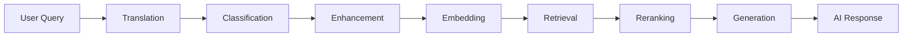
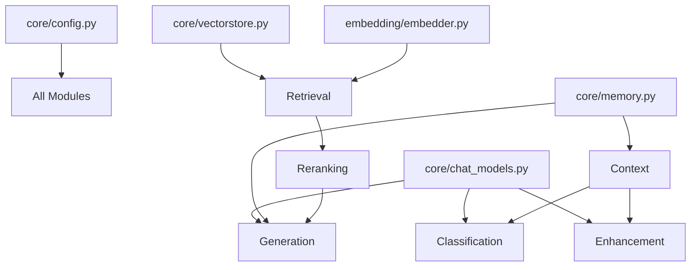

# AI Pipeline - Module Breakdown

The Deen AI pipeline consists of modular components that work together to provide intelligent, source-backed responses. This document details each module in the `modules/` directory.

## Table of Contents

- [Pipeline Overview](#pipeline-overview)
- [Classification Module](#classification-module)
- [Embedding Module](#embedding-module)
- [Enhancement Module](#enhancement-module)
- [Retrieval Module](#retrieval-module)
- [Re-ranking Module](#re-ranking-module)
- [Generation Module](#generation-module)
- [Translation Module](#translation-module)
- [Context Module](#context-module)

## Pipeline Overview

### Module Flow



### Module Organization

```
modules/
├── classification/      # Query filtering and classification
│   └── classifier.py
├── embedding/          # Dense and sparse embeddings
│   ├── embedder.py
│   └── preprocessor.py
├── enhancement/        # Query expansion with context
│   └── enhancer.py
├── retrieval/          # Vector search and document retrieval
│   └── retriever.py
├── reranking/          # Result reranking and scoring
│   └── reranker.py
├── generation/         # Response generation
│   ├── generator.py
│   └── stream_generator.py
├── translation/        # Multi-language support
│   └── translator.py
└── context/            # Chat history management
    └── context.py
```

## Classification Module

**Location**: `modules/classification/classifier.py`

**Purpose**: Filter inappropriate queries and identify fiqh questions

### Functions

#### `classify_non_islamic_query(query, session_id=None)`

Determines if a query is about Islam or off-topic.

**Returns**: `True` if query should be rejected, `False` if it should be processed

**Model**: GPT-4o-mini

**Examples**:
```python
classify_non_islamic_query("What is Tawhid?")  # False (process it)
classify_non_islamic_query("Weather forecast")  # True (reject it)
classify_non_islamic_query("Tell me about Buddhism")  # True (reject it)
```

**With Context**:
```python
# Previous: "Tell me about prayer"
# Current: "How many times a day?"
classify_non_islamic_query("How many times a day?", session_id="user:123")
# False (understands context from previous question)
```

#### `classify_fiqh_query(query, session_id=None)`

Identifies questions requiring religious rulings (fiqh).

**Returns**: `True` if question requires a scholar, `False` if general knowledge

**Examples**:
```python
classify_fiqh_query("Is it permissible to...?")  # True (defer to scholar)
classify_fiqh_query("What is the ruling on...?")  # True (defer to scholar)
classify_fiqh_query("Explain the concept of justice")  # False (general knowledge)
```

### Configuration

```python
# Model used for classification
chat_model = chat_models.get_classifier_model()  # GPT-4o-mini

# Context retrieval
chatContext = context.get_recent_context(session_id, num_messages=2)
```

## Embedding Module

**Location**: `modules/embedding/embedder.py`

**Purpose**: Generate dense and sparse embeddings for semantic search

### Dense Embeddings

**Model**: OpenAI text-embedding-3-small

**Use Case**: Semantic similarity search

```python
def generate_dense_embedding(text: str) -> List[float]:
    """Generate 1536-dimensional dense embedding"""
    # Uses OpenAI embeddings API
    return embedding_vector  # [0.012, -0.034, 0.056, ...]
```

**Characteristics**:
- **Dimension**: 1536
- **Captures**: Semantic meaning, concepts
- **Good For**: "justice in Islam" matches texts about fairness, rights

### Sparse Embeddings

**Algorithm**: BM25-style sparse vectors

**Use Case**: Keyword matching

```python
def generate_sparse_embedding(text: str) -> Dict:
    """Generate sparse embedding for keyword matching"""
    # Returns dictionary of term:weight pairs
    return {
        "indices": [1, 45, 89, ...],
        "values": [0.8, 0.6, 0.4, ...]
    }
```

**Characteristics**:
- **Sparse**: Most values are 0
- **Captures**: Exact terms, names
- **Good For**: "Imam Ali" matches texts with exact name

### Preprocessing

**Location**: `modules/embedding/preprocessor.py`

- Text cleaning
- Normalization
- Tokenization for sparse embeddings

## Enhancement Module

**Location**: `modules/enhancement/enhancer.py`

**Purpose**: Expand queries with conversation context for better retrieval

### Functions

#### `enhance_query(query, session_id=None)`

Enhances a user query by adding context from conversation history.

**Model**: GPT-4o-mini

**Input**: "What about Ali?"

**With Context** (Previous: "Tell me about the Twelve Imams"):
**Output**: "What is the role and significance of Imam Ali in the context of the Twelve Imams in Shia Islam?"

```python
def enhance_query(query: str, session_id: Optional[str] = None) -> str:
    # Load recent chat history from Redis
    history_messages = []
    if session_id:
        history = make_history(session_id)
        history_messages = history.messages
    
    # Use LLM to enhance with context
    prompt = enhancer_prompt_template.invoke({
        "text": query,
        "chat_history": history_messages
    })
    
    enhanced_query = chat_model.invoke(prompt)
    return enhanced_query.content.strip()
```

### Enhancement Strategy

The prompt instructs the LLM to:
1. Resolve ambiguous references using history
2. Expand abbreviated terms
3. Add Islamic context where needed
4. Keep enhancement focused and concise

### Benefits

- **Better Retrieval**: More context = more relevant documents
- **Follows Conversations**: Understands "it", "that", "he"
- **Adds Missing Info**: Implicit Islamic context made explicit

## Retrieval Module

**Location**: `modules/retrieval/retriever.py`

**Purpose**: Retrieve relevant documents from Pinecone vector database

### Functions

#### `retrieve_documents(query, no_of_docs=10)`

Generic retrieval from both dense and sparse indices.

```python
def retrieve_documents(query, no_of_docs=10):
    # 1. Dense retrieval
    dense_vectorstore = get_vectorstore(DEEN_DENSE_INDEX_NAME)
    dense_docs = dense_vectorstore.similarity_search_with_score(query, k=20)
    
    # 2. Sparse retrieval
    sparse_embedding = embedder.generate_sparse_embedding(query)
    sparse_vectorstore = get_sparse_vectorstore(DEEN_SPARSE_INDEX_NAME)
    sparse_docs = sparse_vectorstore.query(
        top_k=20,
        sparse_vector=sparse_embedding,
        namespace="ns1"
    )
    
    # 3. Rerank and return top N
    return reranker.rerank_documents(dense_docs, sparse_docs, no_of_docs)
```

#### `retrieve_shia_documents(query, no_of_docs=10)`

Retrieves only from Shia sources using metadata filters.

```python
def retrieve_shia_documents(query, no_of_docs=10):
    # Same as above but with filter
    dense_docs = dense_vectorstore.similarity_search_with_score(
        query,
        filter={'sect': 'shia'},  # Pinecone metadata filter
        k=no_of_docs
    )
    # ... rest of retrieval
```

#### `retrieve_sunni_documents(query, no_of_docs=10)`

Retrieves only from Sunni sources.

### Retrieval Strategy

**Two-Stage Retrieval**:
1. **Overfetch**: Retrieve top 20 from both indices
2. **Rerank**: Combine and rerank to get best N

**Why?**
- More candidates → better final results
- Diverse retrieval strategies
- Reranking selects the truly best docs

### Vector Indices

**Dense Index**:
- OpenAI embeddings (1536-dim)
- Semantic similarity
- Fast cosine similarity search

**Sparse Index**:
- BM25-style sparse vectors
- Keyword matching
- Fast sparse dot product

Both stored in Pinecone for unified querying.

## Re-ranking Module

**Location**: `modules/reranking/reranker.py`

**Purpose**: Combine dense and sparse results with weighted scoring

### Function

#### `rerank_documents(dense_docs, sparse_docs, top_k)`

Merges and reranks documents from both retrieval strategies.

```python
def rerank_documents(dense_docs_and_scores, sparse_docs, top_k):
    # Weight configuration
    dense_weight = float(DENSE_RESULT_WEIGHT)  # 0.8
    sparse_weight = float(SPARSE_RESULT_WEIGHT)  # 0.2
    
    # Score dense results
    for doc, score in dense_docs_and_scores:
        doc.metadata['final_score'] = score * dense_weight
    
    # Score sparse results
    for doc in sparse_docs:
        original_score = doc.score
        doc.metadata['final_score'] = original_score * sparse_weight
    
    # Merge, deduplicate by text
    combined = merge_and_deduplicate([dense_docs, sparse_docs])
    
    # Sort by final score
    sorted_docs = sorted(combined, key=lambda x: x.metadata['final_score'], reverse=True)
    
    return sorted_docs[:top_k]
```

### Scoring Strategy

**Default Weights**:
- Dense: 80% (semantic similarity is primary)
- Sparse: 20% (keyword matching is secondary)

**Why These Weights?**
- Semantic understanding is most important
- Keywords help with specific names/terms
- 80/20 split found optimal through testing

**Configurable**:
```bash
# In .env
DENSE_RESULT_WEIGHT=0.8
SPARSE_RESULT_WEIGHT=0.2
```

### Deduplication

- Identifies duplicate documents from both sources
- Keeps the one with higher final score
- Ensures diverse results

## Generation Module

**Location**: `modules/generation/`

**Purpose**: Generate AI responses using retrieved context

### Non-Streaming Generation

**File**: `modules/generation/generator.py`

```python
def generate_response(query: str, retrieved_docs: list) -> str:
    """Generate complete response (non-streaming)"""
    references = format_references(retrieved_docs)
    
    chat_model = get_generator_model()  # GPT-4
    prompt = generator_prompt_template.invoke({
        "query": query,
        "references": references
    })
    
    response = chat_model.invoke(prompt)
    return response.content
```

### Streaming Generation

**File**: `modules/generation/stream_generator.py`

```python
def generate_response_stream(query: str, retrieved_docs: list, 
                            session_id: str, target_language: str = "english"):
    """Generate streaming response with chat history"""
    
    # Format references
    references = compact_format_references(retrieved_docs)
    
    # Create chain with Redis history
    chat_model = get_generator_model()
    prompt = generator_prompt_template
    chain = prompt | chat_model
    chain_with_history = with_redis_history(chain)
    
    # Stream chunks
    for chunk in chain_with_history.stream(
        {"target_language": target_language, "query": query, "references": references},
        config={"configurable": {"session_id": session_id}}
    ):
        yield chunk.content
    
    # Trim history after streaming
    history = make_history(session_id)
    trim_history(history)
```

### Elaboration Generation

Special generation for Hikmah elaboration:

```python
def generate_elaboration_response_stream(
    selected_text, context_text, hikmah_tree_name, 
    lesson_name, lesson_summary, retrieved_docs, user_id=None
):
    # Use elaboration-specific prompt
    prompt = hikmah_elaboration_prompt_template
    
    # Stream response
    for chunk in chain.stream({...}):
        yield chunk.content
    
    # Trigger memory agent in background (if user_id provided)
    if user_id:
        spawn_memory_thread(user_id, ...)
```

### Generator Configuration

```python
# Models
get_generator_model()  # Returns ChatOpenAI(model="gpt-4o", streaming=True)

# Temperature
temperature=0.7  # Balanced between creativity and accuracy

# Prompts
generator_prompt_template  # For chat
hikmah_elaboration_prompt_template  # For elaboration
```

## Translation Module

**Location**: `modules/translation/translator.py`

**Purpose**: Enable multi-language support

### Function

#### `translate_to_english(text, source_language)`

Translates user input to English for processing.

```python
def translate_to_english(text: str, source_language: str) -> str:
    """
    Translate text from source_language to English.
    Uses OpenAI for translation.
    """
    # Uses GPT-4 for high-quality translation
    prompt = f"Translate the following {source_language} text to English: {text}"
    
    response = openai_client.chat.completions.create(
        model="gpt-4o-mini",
        messages=[{"role": "user", "content": prompt}]
    )
    
    return response.choices[0].message.content
```

### Translation Flow

**Input Translation**:
```
Arabic query → translate_to_english() → English query → Process pipeline
```

**Output Translation**:
```
Process pipeline → English response → LLM generates in target language → Target language response
```

**Note**: Output translation happens in the generation prompt itself:
```python
# In generator prompt
"Respond in {target_language} language..."
```

### Supported Languages

Any language supported by GPT-4:
- Arabic (العربية)
- Urdu (اردو)
- Persian/Farsi (فارسی)
- Turkish (Türkçe)
- French (Français)
- Spanish (Español)
- And many more...

## Context Module

**Location**: `modules/context/context.py`

**Purpose**: Manage chat history and context retrieval

### Function

#### `get_recent_context(session_id, num_messages=2)`

Retrieves recent chat messages for context-aware operations.

```python
def get_recent_context(session_id: str, num_messages: int = 2) -> str:
    """
    Get recent conversation context from Redis.
    Used by classifier and enhancer for context-aware processing.
    """
    try:
        history = make_history(session_id)
        messages = history.messages[-num_messages:]  # Get last N messages
        
        # Format as string
        context = ""
        for msg in messages:
            role = "User" if msg.type == "human" else "Assistant"
            context += f"{role}: {msg.content}\n"
        
        return context
    except:
        return ""  # Return empty if no history
```

### Use Cases

**Classification**:
```python
# Prevents false rejections on follow-up questions
context = get_recent_context(session_id, 2)
is_islamic = classify_non_islamic_query(query, context)
```

**Enhancement**:
```python
# Adds conversation context to query expansion
context = get_recent_context(session_id, 5)
enhanced = enhance_query(query, context)
```

### Redis Integration

- Uses `RedisChatMessageHistory` from LangChain
- Stored at key: `{KEY_PREFIX}:{session_id}`
- TTL: 12000 seconds (3.3 hours)
- Max messages: 30 per session

## Module Dependencies



## Performance Characteristics

### Latency

| Module | Typical Time | Model/Service |
|--------|--------------|---------------|
| Translation | ~300ms | GPT-4o-mini |
| Classification | ~500ms | GPT-4o-mini |
| Enhancement | ~400ms | GPT-4o-mini |
| Embedding | ~100ms | OpenAI API |
| Retrieval | ~200ms | Pinecone |
| Re-ranking | ~50ms | Local |
| Generation (first token) | ~1000ms | GPT-4 |
| **Total Pipeline** | **~2.5s** | |

### Cost Optimization

**Strategies**:
1. **Use GPT-4o-mini** for classification/enhancement (10x cheaper)
2. **Cache embeddings** in Pinecone (no re-computation)
3. **Retrieval before generation** (cheapest to most expensive)
4. **Context trimming** (reduce input tokens)

## Configuration

### Environment Variables

```bash
# OpenAI
OPENAI_API_KEY=your_key
LARGE_LLM=gpt-4o              # Generation
SMALL_LLM=gpt-4o-mini         # Classification, enhancement

# Pinecone
PINECONE_API_KEY=your_key
DEEN_DENSE_INDEX_NAME=deen-dense
DEEN_SPARSE_INDEX_NAME=deen-sparse

# Retrieval Weights
DENSE_RESULT_WEIGHT=0.8
SPARSE_RESULT_WEIGHT=0.2
REFERENCE_FETCH_COUNT=10

# Redis
REDIS_URL=redis://localhost:6379/0
REDIS_KEY_PREFIX=dev:chat
REDIS_TTL_SECONDS=12000
REDIS_MAX_MESSAGES=30
```

### Model Configuration

**File**: `core/chat_models.py`

```python
def get_generator_model():
    return ChatOpenAI(model=LARGE_LLM, temperature=0.7, streaming=True)

def get_classifier_model():
    return ChatOpenAI(model=SMALL_LLM, temperature=0)

def get_enhancer_model():
    return ChatOpenAI(model=SMALL_LLM, temperature=0.3)
```

## Testing Modules

### Unit Testing

Test individual modules:

```python
# Test classification
from modules.classification import classifier
result = classifier.classify_non_islamic_query("What is Tawhid?")
assert result == False

# Test embedding
from modules.embedding import embedder
embedding = embedder.generate_dense_embedding("test query")
assert len(embedding) == 1536

# Test retrieval
from modules.retrieval import retriever
docs = retriever.retrieve_shia_documents("justice", 5)
assert len(docs) <= 5
```

### Integration Testing

Test full pipeline:

```python
from core import pipeline

response = pipeline.chat_pipeline_streaming(
    user_query="What is Tawhid?",
    session_id="test:123",
    target_language="english"
)

# Verify streaming response
chunks = list(response)
assert len(chunks) > 0
```

## See Also

- [Chatbot Documentation](CHATBOT.md) - How modules combine in chat pipeline
- [Reference Lookup](REFERENCE_LOOKUP.md) - Retrieval-only usage
- [Architecture](ARCHITECTURE.md) - System design overview
- [API Reference](API_REFERENCE.md) - API endpoints using these modules
