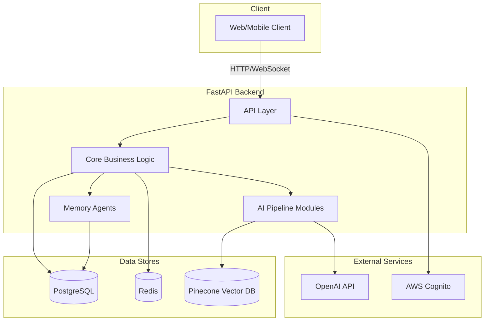
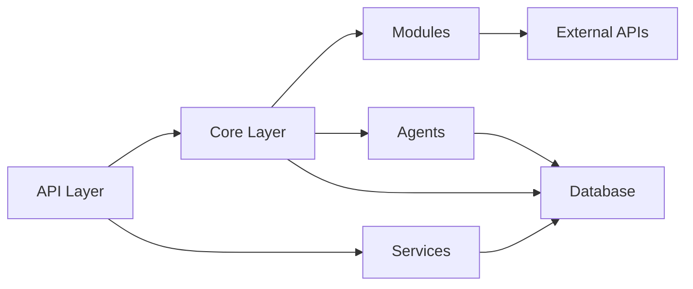
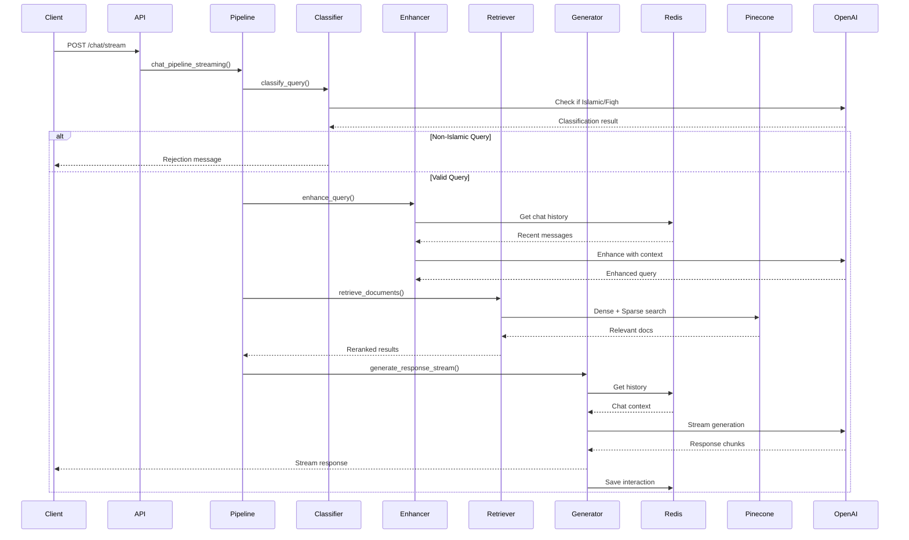
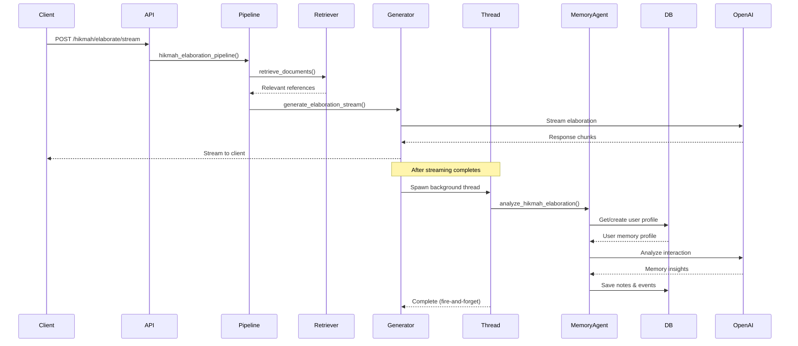
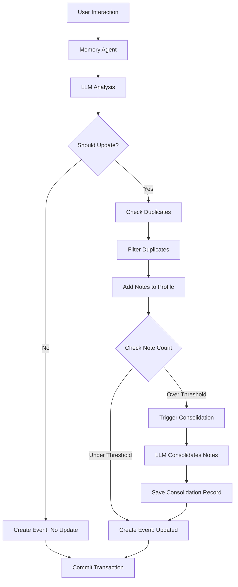
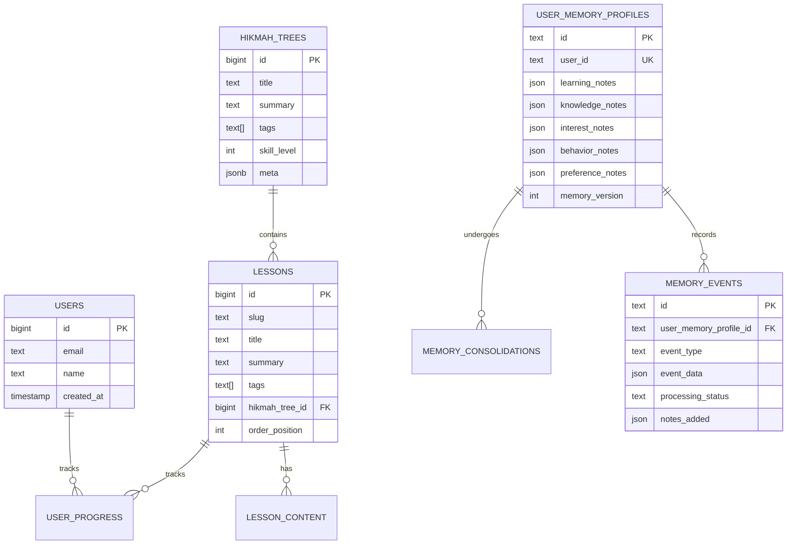
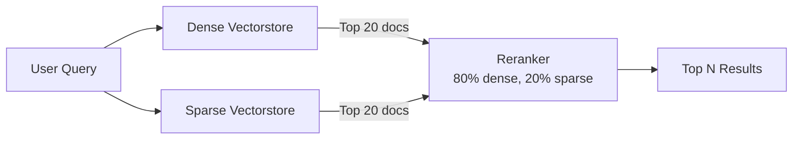
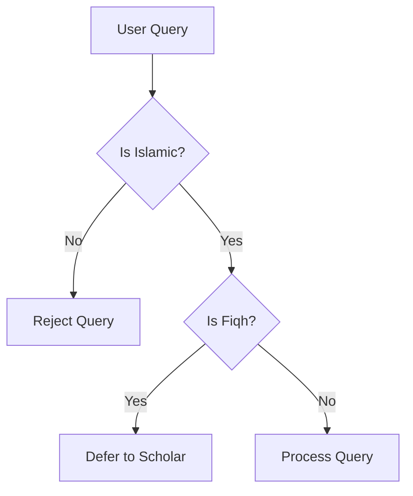
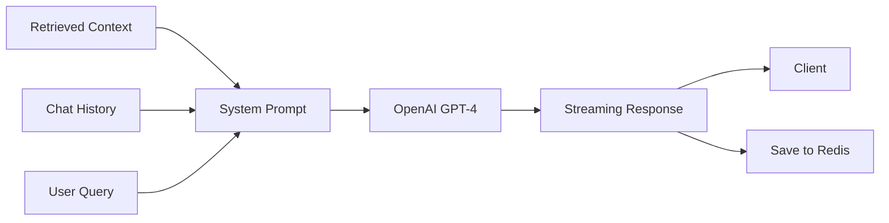
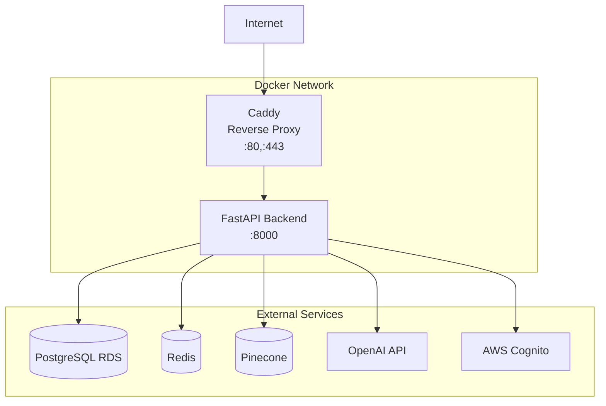

# Deen Backend Architecture

This document provides a comprehensive overview of the Deen backend system architecture, including the technology stack, module organization, data flows, and design patterns.

## Table of Contents

- [System Overview](#system-overview)
- [Technology Stack](#technology-stack)
- [Architecture Layers](#architecture-layers)
- [Module Organization](#module-organization)
- [Data Flow](#data-flow)
- [Database Architecture](#database-architecture)
- [AI Pipeline Architecture](#ai-pipeline-architecture)
- [Memory System Architecture](#memory-system-architecture)
- [Deployment Architecture](#deployment-architecture)

## System Overview

Deen is an AI-powered Islamic education platform backend that combines:

- **RAG (Retrieval-Augmented Generation)** for accurate, source-backed AI responses
- **Hybrid Vector Search** for semantic similarity and keyword matching
- **Adaptive Memory System** that learns from user interactions
- **Streaming Responses** for real-time user experience
- **Multi-language Support** for global accessibility

### High-Level Architecture



## Technology Stack

### Core Framework

- **FastAPI** (v0.115.8) - High-performance web framework with automatic API documentation
- **Python 3.8+** - Programming language
- **Uvicorn/Gunicorn** - ASGI server for production deployment

### AI/ML Stack

- **OpenAI GPT-4** - Large language model for generation
- **LangChain** (v0.3.27) - LLM application framework
- **LangGraph** (v0.2.64) - Agent workflow orchestration
- **Sentence Transformers** (v3.4.1) - Dense embeddings
- **Pinecone** (v7.3.0) - Vector database for semantic search

### Data Storage

- **PostgreSQL** - Primary relational database (RDS in production)
- **Redis** - Session storage and conversation memory
- **Pinecone** - Vector embeddings for semantic search
  - Dense index (OpenAI embeddings)
  - Sparse index (keyword-based)

### Infrastructure

- **Docker** - Containerization
- **Docker Compose** - Local development orchestration
- **Caddy** - Reverse proxy and HTTPS termination
- **AWS Cognito** - User authentication and management
- **Alembic** - Database migration tool

### Development Tools

- **SQLAlchemy** (v2.0.41) - ORM and database toolkit
- **Pydantic** (v2.10.6) - Data validation and settings
- **pytest** - Testing framework

## Architecture Layers

The backend follows a layered architecture pattern:

### 1. API Layer (`api/`)

**Responsibility**: HTTP endpoint handlers, request/response validation

```
api/
├── account.py       # User account management
├── chat.py          # Chatbot endpoints
├── hikmah.py        # Hikmah tree elaboration
├── memory_admin.py  # Memory admin dashboard
└── reference.py     # Reference lookup
```

**Key Features**:
- JWT authentication via AWS Cognito
- Request validation with Pydantic models
- Streaming response support
- Error handling middleware

### 2. Core Layer (`core/`)

**Responsibility**: Business logic, AI pipelines, configuration

```
core/
├── pipeline.py           # Main AI pipelines
├── memory.py             # Redis conversation memory
├── config.py             # Environment configuration
├── auth.py               # JWT authentication logic
├── chat_models.py        # LLM model instances
├── prompt_templates.py   # System prompts
├── utils.py              # Utility functions
└── vectorstore.py        # Pinecone connection
```

**Key Features**:
- Orchestrates AI pipelines
- Manages Redis-backed conversation history
- Configures LLM models and prompts
- Handles authentication logic

### 3. Modules Layer (`modules/`)

**Responsibility**: AI pipeline components (RAG system)

```
modules/
├── classification/    # Query type classification
├── embedding/         # Dense + sparse embeddings
├── enhancement/       # Query enhancement
├── retrieval/         # Document retrieval
├── reranking/         # Result reranking
├── generation/        # Response generation
└── translation/       # Multi-language support
```

**Key Features**:
- Modular, reusable AI components
- Hybrid search (dense + sparse)
- Context-aware query enhancement
- Streaming generation

### 4. Agents Layer (`agents/`)

**Responsibility**: Agentic AI behaviors (memory system)

```
agents/
├── core/
│   ├── universal_memory_agent.py  # Universal memory agent
│   └── memory_consolidator.py     # Memory consolidation
├── models/
│   ├── user_memory_models.py      # SQLAlchemy models
│   └── db_config.py                # Database configuration
└── prompts/
    ├── memory_prompts.py           # Memory agent prompts
    └── note_templates.py           # Note templates
```

**Key Features**:
- Learns from user interactions
- Consolidates memory to prevent bloat
- Prevents duplicate notes
- Background processing

### 5. Database Layer (`db/`)

**Responsibility**: Data persistence, CRUD operations

```
db/
├── models/         # SQLAlchemy ORM models
├── schemas/        # Pydantic schemas
├── repositories/   # Data access layer
├── routers/        # CRUD API endpoints
├── crud/           # Legacy CRUD operations
└── session.py      # Database session management
```

**Key Features**:
- Repository pattern for data access
- Type-safe schemas with Pydantic
- RESTful CRUD endpoints
- Alembic migrations

### 6. Services Layer (`services/`)

**Responsibility**: Business logic services

```
services/
├── account_service.py          # Account operations
├── memory_service.py           # Memory operations
└── consolidation_service.py    # Memory consolidation
```

**Key Features**:
- Encapsulates complex business logic
- Reusable across multiple endpoints
- Transaction management

## Module Organization

### Separation of Concerns

The codebase follows **domain-driven design** principles:

1. **API Handlers** - Only handle HTTP concerns
2. **Core Logic** - Domain logic lives here
3. **Modules** - Reusable AI components
4. **Agents** - Autonomous behaviors
5. **Database** - Data persistence only
6. **Services** - Cross-cutting concerns

### Dependency Flow



**Rule**: Lower layers never depend on upper layers.

## Data Flow

### Chat Pipeline Flow



### Hikmah Elaboration Flow



### Memory Update Flow



## Database Architecture

### Schema Overview

The database uses PostgreSQL with two main domains:

1. **Learning Platform Domain**
   - `users` - User accounts
   - `hikmah_trees` - Course structures
   - `lessons` - Individual lessons
   - `lesson_content` - Lesson content blocks
   - `user_progress` - User learning progress

2. **Memory System Domain**
   - `user_memory_profiles` - User memory profiles
   - `memory_events` - Interaction tracking
   - `memory_consolidations` - Consolidation history

### Entity Relationships



See [Database Documentation](DATABASE.md) for complete schema details.

## AI Pipeline Architecture

### Hybrid Retrieval System

The system uses a hybrid approach combining:

1. **Dense Retrieval** - Semantic similarity via OpenAI embeddings
2. **Sparse Retrieval** - Keyword matching via BM25-style sparse vectors
3. **Re-ranking** - Weighted combination of both results



### Classification System

Multi-stage query classification:

1. **Islamic Relevance** - Is the query about Islam?
2. **Fiqh Detection** - Does it require a religious ruling?



### Generation Pipeline



## Memory System Architecture

### Universal Memory Agent

The memory agent is **interaction-agnostic** and can process:

- Chat conversations
- Lesson completions
- Quiz results
- Hikmah elaboration requests
- User feedback
- And any future interaction types

### Note Categories

Memory is organized into 5 categories:

1. **Learning Notes** - What user is studying, current focus
2. **Knowledge Notes** - What user knows/doesn't know
3. **Interest Notes** - Topics that engage the user
4. **Behavior Notes** - Learning patterns and habits
5. **Preference Notes** - Learning style preferences

### Consolidation Strategy

When notes exceed threshold (e.g., 100 notes), the system:

1. Identifies redundant notes
2. Merges similar observations
3. Creates summary notes
4. Removes outdated information

See [Memory Agent Documentation](MEMORY_AGENT.md) for details.

## Deployment Architecture

### Docker Compose Setup



### Production Deployment (EC2)

- **Application**: Docker containers on EC2
- **Database**: PostgreSQL RDS
- **Cache**: Redis (ElastiCache or self-hosted)
- **Vector DB**: Pinecone (SaaS)
- **Auth**: AWS Cognito
- **Proxy**: Caddy for HTTPS termination

See [Deployment Documentation](DEPLOYMENT.md) for complete guide.

## Design Patterns

### Repository Pattern

Data access is abstracted through repositories:

```python
# Repository handles all database operations
class MemoryProfileRepository:
    def get_by_user_id(self, db: Session, user_id: str) -> UserMemoryProfile:
        pass
    
    def create(self, db: Session, user_id: str, defaults: dict) -> UserMemoryProfile:
        pass
```

### Service Layer Pattern

Complex business logic lives in services:

```python
# Service coordinates multiple repositories and logic
class MemoryService:
    def __init__(self, db: Session):
        self.profile_repo = MemoryProfileRepository()
        self.event_repo = MemoryEventRepository()
    
    def add_notes(self, profile: UserMemoryProfile, notes: List[Dict]):
        # Complex logic here
        pass
```

### Dependency Injection

FastAPI's dependency injection for database sessions:

```python
@router.get("/users/{user_id}")
def get_user(user_id: str, db: Session = Depends(get_db)):
    # db session automatically injected
    pass
```

### Streaming Response Pattern

For real-time user experience:

```python
async def generate_stream():
    for chunk in llm.stream(...):
        yield chunk

return StreamingResponse(generate_stream(), media_type="text/event-stream")
```

## Performance Considerations

### Redis for Session Storage

- **TTL-based expiration** prevents memory bloat
- **Message limit** (default: 30 messages) keeps context manageable
- **Key prefixes** enable multi-tenant support

### Background Processing

- **Fire-and-forget threads** for memory updates
- **Daemon threads** don't block shutdown
- **Separate event loops** prevent conflicts

### Vector Search Optimization

- **Sect filtering** at Pinecone query level
- **Reranking** reduces LLM input tokens
- **Cached embeddings** in Pinecone

### Database Connection Pooling

- SQLAlchemy connection pool
- Single source of truth for database config
- Reused across application and agents

## Security

### Authentication

- JWT tokens via AWS Cognito
- Token validation with JWKS
- Protected endpoints with `Depends(auth)`

### CORS

- Environment-based allowed origins
- Credentials support for cookies
- Development localhost exemptions

### Database

- Parameterized queries (SQL injection prevention)
- Connection string from environment
- No credentials in code

## Monitoring & Debugging

### Health Endpoints

- `GET /health` - Basic health check
- `GET /_debug/db` - Database connectivity
- `GET /_routes` - List all routes

### Logging

- Structured logging with `logging_config.py`
- Memory agent debug logs
- LLM interaction logging

### Memory Admin Dashboard

Interactive web UI at `/admin/memory/dashboard` for:
- Inspecting user memory profiles
- Viewing memory events
- Debugging consolidation

See [Memory Agent Documentation](MEMORY_AGENT.md) for dashboard usage.

## See Also

- [Chatbot Documentation](CHATBOT.md) - RAG pipeline details
- [AI Pipeline Documentation](AI_PIPELINE.md) - Module-by-module breakdown
- [Database Documentation](DATABASE.md) - Schema and migrations
- [Deployment Documentation](DEPLOYMENT.md) - Production setup
- [API Reference](API_REFERENCE.md) - Complete endpoint documentation
