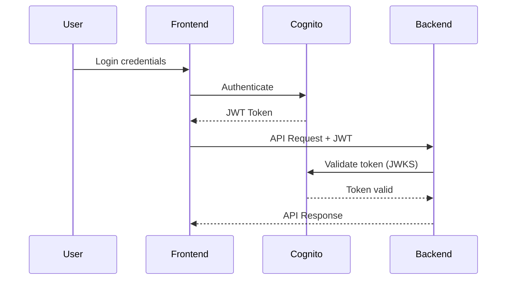

# Authentication - AWS Cognito & JWT

The Deen backend uses AWS Cognito for user authentication with JWT token validation.

## Table of Contents

- [Overview](#overview)
- [AWS Cognito Setup](#aws-cognito-setup)
- [JWT Token Validation](#jwt-token-validation)
- [Protected Endpoints](#protected-endpoints)
- [Token Structure](#token-structure)
- [Account Deletion Flow](#account-deletion-flow)
- [Troubleshooting](#troubleshooting)

## Overview

### Authentication Flow



### Key Components

- **AWS Cognito**: User pool for authentication
- **JWT Tokens**: Bearer tokens for API access
- **JWKS**: Public keys for token validation
- **JWTBearer**: FastAPI dependency for protection

## AWS Cognito Setup

### Environment Variables

```bash
# In .env
COGNITO_REGION=us-east-1
COGNITO_POOL_ID=us-east-1_ABC123DEF
```

### Cognito Configuration

**User Pool**:
- Region: Configured via `COGNITO_REGION`
- Pool ID: Configured via `COGNITO_POOL_ID`
- Authentication flow: User SRP (Secure Remote Password)

**App Client**:
- Created in Cognito User Pool
- No client secret (for public clients like web/mobile apps)
- Enabled authentication flows

### JWKS Endpoint

Cognito provides public keys for JWT validation:

```
https://cognito-idp.{region}.amazonaws.com/{userPoolId}/.well-known/jwks.json
```

Example:
```
https://cognito-idp.us-east-1.amazonaws.com/us-east-1_ABC123DEF/.well-known/jwks.json
```

## JWT Token Validation

### JWTBearer Implementation

**File**: `models/JWTBearer.py`

```python
from fastapi import HTTPException, Request
from fastapi.security import HTTPBearer, HTTPAuthorizationCredentials
from jose import jwt, jwk
from jose.utils import base64url_decode
import requests

class JWTBearer(HTTPBearer):
    def __init__(self, jwks: dict):
        super().__init__(auto_error=True)
        self.jwks = jwks
    
    async def __call__(self, request: Request):
        credentials: HTTPAuthorizationCredentials = await super().__call__(request)
        
        if credentials:
            if not credentials.scheme == "Bearer":
                raise HTTPException(status_code=403, detail="Invalid authentication scheme")
            
            # Validate and decode token
            payload = self.verify_jwt(credentials.credentials)
            
            if not payload:
                raise HTTPException(status_code=403, detail="Invalid token or expired token")
            
            return payload
        else:
            raise HTTPException(status_code=403, detail="Invalid authorization code")
    
    def verify_jwt(self, token: str):
        # Decode token header to get kid (key ID)
        headers = jwt.get_unverified_headers(token)
        kid = headers['kid']
        
        # Find matching key in JWKS
        key = next((k for k in self.jwks['keys'] if k['kid'] == kid), None)
        
        if not key:
            return None
        
        # Verify token signature and claims
        try:
            payload = jwt.decode(
                token,
                key,
                algorithms=['RS256'],
                audience=None  # Adjust based on your Cognito config
            )
            return payload
        except:
            return None
```

### Loading JWKS

**File**: `core/auth.py`

```python
import requests
from core.config import COGNITO_REGION, COGNITO_POOL_ID

# Construct JWKS URL
jwks_url = f"https://cognito-idp.{COGNITO_REGION}.amazonaws.com/{COGNITO_POOL_ID}/.well-known/jwks.json"

# Fetch JWKS (public keys for token validation)
jwks = requests.get(jwks_url).json()

# Create JWT bearer instance
from models.JWTBearer import JWTBearer
auth = JWTBearer(jwks)
```

### Token Validation Process

1. **Extract Token**: From `Authorization: Bearer <token>` header
2. **Decode Header**: Get `kid` (key ID) from token header
3. **Find Key**: Match `kid` with key in JWKS
4. **Verify Signature**: Use public key to verify token signature
5. **Validate Claims**: Check expiration, issuer, etc.
6. **Return Payload**: Token claims if valid

## Protected Endpoints

### Applying Authentication

**In main.py**:

```python
from fastapi import Depends
from models.JWTBearer import JWTBearer
from core.auth import auth

# Protect entire router
app.include_router(
    chat.chat_router,
    dependencies=[Depends(auth)]
)

# Protect individual endpoint
@app.get("/protected", dependencies=[Depends(auth)])
def protected_route():
    return {"message": "You're authenticated!"}
```

### Accessing User Info

```python
from models.JWTBearer import JWTAuthorizationCredentials
from fastapi import Depends

@router.get("/me")
async def get_user_info(credentials: JWTAuthorizationCredentials = Depends(auth)):
    user_id = credentials.claims.get("sub")
    email = credentials.claims.get("email")
    username = credentials.claims.get("cognito:username")
    
    return {
        "user_id": user_id,
        "email": email,
        "username": username
    }
```

### Public Endpoints

Some endpoints don't require authentication:

```python
@app.get("/health")  # No Depends(auth)
def health():
    return {"status": "ok"}

@router.get("/admin/memory/dashboard")  # Developer tool
def dashboard():
    return HTMLResponse(...)
```

## Token Structure

### JWT Claims

A typical Cognito JWT contains:

```json
{
  "sub": "abc-123-def-456",              // User ID (UUID)
  "email": "user@example.com",
  "email_verified": true,
  "cognito:username": "user123",
  "aud": "app-client-id",
  "event_id": "event-uuid",
  "token_use": "id",                     // or "access"
  "auth_time": 1705334400,
  "iss": "https://cognito-idp.us-east-1.amazonaws.com/us-east-1_ABC123",
  "exp": 1705420800,                     // Expiration timestamp
  "iat": 1705334400                      // Issued at timestamp
}
```

### Important Claims

- **sub**: Unique user identifier (use this for user_id)
- **email**: User's email address
- **cognito:username**: Username in Cognito
- **exp**: Expiration time (Unix timestamp)
- **iss**: Issuer (Cognito URL)

### Token Types

**ID Token**:
- Contains user information (claims)
- Used for authentication
- Short-lived (typically 1 hour)

**Access Token**:
- Used for API authorization
- Contains scopes/permissions
- Can be used interchangeably with ID token in this app

**Refresh Token**:
- Used to obtain new ID/access tokens
- Longer-lived
- Handled by frontend

## Account Deletion Flow

### Complete Deletion Process

**File**: `api/account.py`

```python
@router.delete("/me", status_code=204)
async def delete_my_account(
    credentials: JWTAuthorizationCredentials = Depends(auth),
    db: Session = Depends(get_db)
):
    # 1. Extract user_id from JWT
    user_id = credentials.claims.get("sub")
    
    # 2. Delete all database data
    deleted_counts = delete_user_data(user_id, db)
    
    # 3. Clear Redis sessions
    sessions_cleared = clear_user_redis_sessions(user_id)
    
    # 4. Delete from AWS Cognito
    cognito_client = boto3.client('cognito-idp', region_name=COGNITO_REGION)
    cognito_username = credentials.claims.get("cognito:username")
    
    cognito_client.admin_delete_user(
        UserPoolId=COGNITO_POOL_ID,
        Username=cognito_username
    )
    
    return None  # 204 No Content
```

### What Gets Deleted

1. **Database**: User progress, memory profiles, events, consolidations
2. **Redis**: All session data for user
3. **Cognito**: User account completely removed

### IAM Permissions Required

For account deletion, the EC2 instance (or service) needs IAM permissions:

```json
{
  "Version": "2012-10-17",
  "Statement": [
    {
      "Effect": "Allow",
      "Action": [
        "cognito-idp:AdminDeleteUser",
        "cognito-idp:AdminGetUser"
      ],
      "Resource": "arn:aws:cognito-idp:REGION:ACCOUNT_ID:userpool/POOL_ID"
    }
  ]
}
```

## Frontend Integration

### Obtaining Tokens

**Using AWS Amplify** (recommended):

```javascript
import { Auth } from 'aws-amplify';

// Configure Amplify
Auth.configure({
  region: 'us-east-1',
  userPoolId: 'us-east-1_ABC123',
  userPoolWebClientId: 'app-client-id'
});

// Sign in
const user = await Auth.signIn(username, password);

// Get JWT token
const session = await Auth.currentSession();
const idToken = session.getIdToken().getJwtToken();

// Use in API calls
fetch('http://localhost:8000/chat', {
  headers: {
    'Authorization': `Bearer ${idToken}`,
    'Content-Type': 'application/json'
  },
  body: JSON.stringify({...})
});
```

### Token Refresh

Tokens expire after ~1 hour. Frontend should:

1. Check expiration before API calls
2. Refresh token if expired
3. Retry failed requests with new token

```javascript
async function makeAuthenticatedRequest(url, options) {
  // Check if token is expired
  const session = await Auth.currentSession();
  const token = session.getIdToken().getJwtToken();
  
  // Make request
  const response = await fetch(url, {
    ...options,
    headers: {
      ...options.headers,
      'Authorization': `Bearer ${token}`
    }
  });
  
  // Handle 401 (token expired)
  if (response.status === 401) {
    // Refresh and retry
    await Auth.currentSession();  // Forces refresh
    return makeAuthenticatedRequest(url, options);
  }
  
  return response;
}
```

## Troubleshooting

### Common Issues

**Invalid Token Error**:
```
403 Forbidden: Invalid token or expired token
```

**Causes**:
- Token expired (check `exp` claim)
- Wrong Cognito pool (check `COGNITO_POOL_ID`)
- Token from different environment (dev vs prod)
- JWKS cache stale (restart backend)

**Solutions**:
- Refresh token on frontend
- Verify environment variables
- Check Cognito configuration
- Restart backend to reload JWKS

---

**Missing Authorization Header**:
```
403 Forbidden: Invalid authorization code
```

**Cause**: No `Authorization` header sent

**Solution**: Ensure frontend sends:
```javascript
headers: {
  'Authorization': `Bearer ${token}`
}
```

---

**Wrong Scheme**:
```
403 Forbidden: Invalid authentication scheme
```

**Cause**: Using wrong auth scheme (e.g., `Basic` instead of `Bearer`)

**Solution**: Must use `Bearer` scheme

---

**User Not Found in Cognito**:
```
UserNotFoundException when deleting account
```

**Cause**: User already deleted or doesn't exist

**Solution**: This is handled gracefully in code (not an error)

### Debugging

**Check Token Claims**:

```python
# Decode without verification (for debugging only!)
from jose import jwt

token = "eyJ..."
claims = jwt.get_unverified_claims(token)
print(claims)
```

**Test Endpoint**:

```bash
# Get user info from token
curl -X GET "http://localhost:8000/account/me" \
  -H "Authorization: Bearer YOUR_TOKEN"
```

**Verify JWKS Loading**:

```python
# Check if JWKS loaded correctly
from core.auth import jwks
print(jwks)  # Should show keys array
```

## Security Best Practices

1. **Never log tokens** - They're secrets
2. **Use HTTPS in production** - Prevents token theft
3. **Short token lifetimes** - Limit exposure window
4. **Rotate secrets** - If JWKS changes, restart backend
5. **Validate all claims** - Don't trust token blindly
6. **Use refresh tokens** - Don't ask users to re-login frequently

## See Also

- [API Reference](API_REFERENCE.md) - Protected endpoints
- [Account API](API_REFERENCE.md#account-management) - Account management endpoints
- [Deployment](DEPLOYMENT.md) - Production authentication setup
