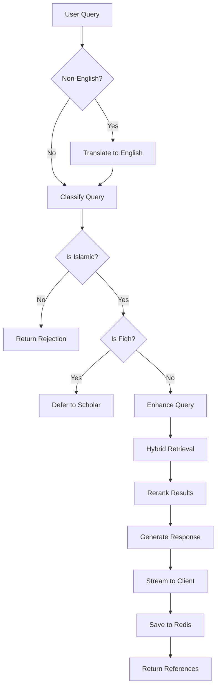
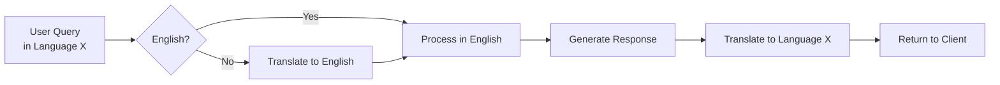

# Chatbot - RAG-Powered Conversational AI

The Deen chatbot provides intelligent, source-backed responses to questions about Islam using a Retrieval-Augmented Generation (RAG) pipeline with conversation memory and multi-language support.

## Table of Contents

- [Overview](#overview)
- [Pipeline Architecture](#pipeline-architecture)
- [Query Classification](#query-classification)
- [Query Enhancement](#query-enhancement)
- [Document Retrieval](#document-retrieval)
- [Response Generation](#response-generation)
- [Conversation Memory](#conversation-memory)
- [Multi-language Support](#multi-language-support)
- [API Endpoints](#api-endpoints)
- [Usage Examples](#usage-examples)

## Overview

### Key Features

- **RAG Pipeline** - Combines retrieval and generation for accurate responses
- **Hybrid Search** - Dense (semantic) + sparse (keyword) retrieval
- **Query Classification** - Filters inappropriate queries and defers fiqh questions
- **Context-Aware** - Uses conversation history to understand follow-up questions
- **Streaming Responses** - Real-time response delivery for better UX
- **Redis Memory** - Scalable conversation history storage
- **Sect-Aware** - Retrieves from both Shia and Sunni sources
- **Multi-language** - Supports translation from various languages

### Tech Stack

- **LLM**: OpenAI GPT-4 (configurable)
- **Embeddings**: OpenAI text-embedding-3-small
- **Vector DB**: Pinecone (dense + sparse indices)
- **Memory**: Redis with TTL
- **Framework**: LangChain

## Pipeline Architecture

The chat pipeline follows these steps:



### Code Flow

The main pipeline is in `core/pipeline.py`:

```python
def chat_pipeline_streaming(user_query: str, session_id: str, target_language: str = "english"):
    # 1. Translation (if needed)
    if target_language != "english":
        user_query = translator.translate_to_english(user_query, target_language)
    
    # 2. Classification
    is_non_islamic = classifier.classify_non_islamic_query(user_query, session_id)
    if is_non_islamic:
        return rejection_message()
    
    is_fiqh = classifier.classify_fiqh_query(user_query, session_id)
    if is_fiqh:
        return defer_to_scholar_message()
    
    # 3. Enhancement
    enhanced_query = enhancer.enhance_query(user_query, session_id)
    
    # 4. Retrieval (Shia: 5 docs, Sunni: 2 docs)
    relevant_shia_docs = retriever.retrieve_shia_documents(enhanced_query, 5)
    relevant_sunni_docs = retriever.retrieve_sunni_documents(enhanced_query, 2)
    all_relevant_docs = relevant_shia_docs + relevant_sunni_docs
    
    # 5. Generation with streaming
    response_generator = stream_generator.generate_response_stream(
        user_query, all_relevant_docs, session_id, target_language
    )
    
    # 6. Append references
    references_tail = format_references(all_relevant_docs)
    
    return StreamingResponse(chain(response_generator, references_tail))
```

Location: `core/pipeline.py` (`chat_pipeline_streaming` function)

## Query Classification

### Purpose

Classification filters queries to ensure:
1. Questions are related to Islam
2. Fiqh (legal rulings) questions are deferred to scholars

### Two-Stage Classification

#### Stage 1: Islamic Relevance Check

**File**: `modules/classification/classifier.py` (`classify_non_islamic_query`)

```python
def classify_non_islamic_query(query: str, session_id: str = None) -> bool:
    """Returns True if query is NOT about Islam"""
    # Uses GPT-4o-mini for classification
    # Considers recent chat context if session_id provided
    # Returns True for rejection, False to continue
```

**Example Rejections**:
- "What's the weather today?" → Rejected
- "How to bake a cake?" → Rejected
- "Tell me about Buddhism" → Rejected

**Example Accepted**:
- "What is Tawhid?" → Accepted
- "Explain the concept of Imamate" → Accepted

#### Stage 2: Fiqh Detection

**File**: `modules/classification/classifier.py` (`classify_fiqh_query`)

```python
def classify_fiqh_query(query: str, session_id: str = None) -> bool:
    """Returns True if query requires religious legal ruling"""
    # Uses GPT-4o-mini for classification
    # Defers fiqh questions to qualified scholars
```

**Example Fiqh Questions**:
- "Is it permissible to...?" → Deferred
- "What's the ruling on...?" → Deferred
- "Can I...? (in religious context)" → Deferred

**Example Non-Fiqh Questions**:
- "What does Islam say about justice?" → Processed
- "Who was Imam Ali?" → Processed
- "Explain the concept of Tawhid" → Processed

### Context-Aware Classification

Both classifiers can use recent conversation history:

```python
# Get recent context from Redis
chatContext = context.get_recent_context(session_id, num_messages=2)

# Include in classification prompt
prompt = classifier_prompt.invoke({
    "query": query,
    "chatContext": chatContext
})
```

This prevents false rejections on follow-up questions like:
- User: "Tell me about prayer"
- Bot: "Prayer is..."
- User: "How many times a day?" ← Would be rejected without context

## Query Enhancement

### Purpose

Enhancement improves retrieval quality by:
1. Adding context from conversation history
2. Expanding abbreviations and unclear terms
3. Making implicit references explicit

### Implementation

**File**: `modules/enhancement/enhancer.py` (`enhance_query`)

```python
def enhance_query(query: str, session_id: Optional[str] = None) -> str:
    """Enhances query with conversation context for better retrieval"""
    
    # Load recent chat history from Redis
    history_messages = []
    if session_id:
        history = make_history(session_id)
        history_messages = history.messages
    
    # Use LLM to enhance query
    prompt = enhancer_prompt_template.invoke({
        "text": query,
        "chat_history": history_messages
    })
    
    enhanced_query = chat_model.invoke(prompt)
    return enhanced_query.content.strip()
```

### Example Enhancement

**Original Query**: "What about Ali?"

**With Context** (Previous: "Tell me about the Twelve Imams"):
- **Enhanced**: "What is the role of Imam Ali in the context of the Twelve Imams in Shia Islam?"

**Original Query**: "Explain taqwa"

**Enhanced**: "Explain the concept of taqwa (God-consciousness) in Islam, including its significance and how it is cultivated"

### Enhancement Prompt

The enhancement prompt instructs the LLM to:
- Use conversation history to resolve ambiguities
- Expand implicit references
- Add Islamic context where needed
- Keep enhancement concise and focused

Location: `core/prompt_templates.py` (`enhancer_prompt_template`)

## Document Retrieval

### Hybrid Retrieval Strategy

The system uses **two types of embeddings** for better results:

1. **Dense Embeddings** (Semantic)
   - OpenAI text-embedding-3-small
   - Captures meaning and concepts
   - Good for "What is justice in Islam?"

2. **Sparse Embeddings** (Keyword)
   - BM25-style sparse vectors
   - Captures exact terms and names
   - Good for "Imam Ali" or "Surah Al-Fatiha"

### Retrieval Process

**File**: `modules/retrieval/retriever.py`

```python
def retrieve_shia_documents(query, no_of_docs=10):
    # 1. Dense retrieval
    dense_vectorstore = get_vectorstore(DEEN_DENSE_INDEX_NAME)
    dense_docs = dense_vectorstore.similarity_search_with_score(
        query,
        filter={'sect': 'shia'},
        k=no_of_docs
    )
    
    # 2. Sparse retrieval
    sparse_embedding = embedder.generate_sparse_embedding(query)
    sparse_vectorstore = get_sparse_vectorstore(DEEN_SPARSE_INDEX_NAME)
    sparse_docs = sparse_vectorstore.query(
        top_k=no_of_docs,
        sparse_vector=sparse_embedding,
        namespace="ns1",
        filter={'sect': 'shia'}
    )
    
    # 3. Rerank and combine
    result = reranker.rerank_documents(dense_docs, sparse_docs, no_of_docs)
    return result
```

### Sect Filtering

The chatbot retrieves from **both** Shia and Sunni sources:

```python
# Retrieve 5 Shia documents (primary focus)
relevant_shia_docs = retriever.retrieve_shia_documents(enhanced_query, 5)

# Retrieve 2 Sunni documents (for broader perspective)
relevant_sunni_docs = retriever.retrieve_sunni_documents(enhanced_query, 2)

# Combine for generation
all_relevant_docs = relevant_shia_docs + relevant_sunni_docs
```

This provides:
- **Shia perspective** as primary focus (5 docs)
- **Sunni perspective** for comparison (2 docs)
- **Balanced responses** acknowledging both traditions

### Re-ranking

**File**: `modules/reranking/reranker.py`

Combines dense and sparse results with weighted scoring:

```python
def rerank_documents(dense_docs, sparse_docs, top_k):
    # Weighted combination (80% dense, 20% sparse by default)
    for doc in dense_docs:
        score = doc.score * DENSE_WEIGHT  # 0.8
    
    for doc in sparse_docs:
        score = doc.score * SPARSE_RESULT_WEIGHT  # 0.2
    
    # Merge, deduplicate, and return top K
    return sorted_combined_docs[:top_k]
```

### Document Metadata

Each retrieved document includes:

```python
{
    'metadata': {
        'book': 'Al-Kafi',
        'chapter': 'Chapter on Imamate',
        'hadith_number': '5',
        'text': 'Al-Husayn ibn Muhammad has narrated...',
        'author': 'Shaykh Muḥammad b. Yaʿqūb al-Kulaynī',
        'volume': 'Volume 1',
        'source': 'Shi\'i Hadith',
        'sect': 'shia'
    }
}
```

## Response Generation

### Streaming Generation

**File**: `modules/generation/stream_generator.py`

```python
def generate_response_stream(query: str, retrieved_docs: list, 
                            session_id: str, target_language: str = "english"):
    # Format references
    references = utils.compact_format_references(retrieved_docs)
    
    # Load chat history
    chain_with_history = with_redis_history(chat_model_chain)
    
    # Stream response
    for chunk in chain_with_history.stream(
        {"target_language": target_language, "query": query, "references": references},
        config={"configurable": {"session_id": session_id}}
    ):
        yield chunk.content
    
    # Trim history after streaming
    history = make_history(session_id)
    trim_history(history)
```

### System Prompt

The generator prompt instructs the LLM to:

1. **Use Retrieved Context**: Base answers on provided references
2. **Cite Sources**: Reference specific texts when possible
3. **Shia Perspective**: Prioritize Shia Islamic viewpoint
4. **Acknowledge Differences**: Note Sunni perspectives when relevant
5. **Be Accurate**: Don't make up information
6. **Target Language**: Respond in user's preferred language

Location: `core/prompt_templates.py` (`generator_prompt_template`)

### Response Format

Responses include:

1. **Main Answer** (streamed)
2. **References** (appended after streaming)

```json
// Streamed text response...

[REFERENCES]

[
  {
    "book": "Al-Kafi",
    "chapter": "Chapter on Imamate",
    "text": "...",
    "author": "Shaykh al-Kulaynī",
    "source": "Shi'i Hadith"
  }
]
```

## Conversation Memory

### Redis-Backed History

**File**: `core/memory.py`

```python
def make_history(session_id: str) -> RedisChatMessageHistory:
    """Create Redis-backed chat history"""
    return RedisChatMessageHistory(
        session_id=session_id,
        url=REDIS_URL,
        key_prefix=KEY_PREFIX,  # "dev:chat"
        ttl=TTL_SECONDS  # 12000 seconds (3.3 hours)
    )
```

### History Management

**Configuration**:
- **TTL**: 12,000 seconds (auto-expire old conversations)
- **Max Messages**: 30 messages (trimmed after each interaction)
- **Key Prefix**: `dev:chat:{session_id}`

**Trimming Logic**:

```python
def trim_history(history: RedisChatMessageHistory):
    """Keep only last MAX_MESSAGES (30) in history"""
    messages = history.messages
    if len(messages) > MAX_MESSAGES:
        # Keep only recent messages
        history.clear()
        for msg in messages[-MAX_MESSAGES:]:
            history.add_message(msg)
```

### Session ID Format

Recommended format: `{user_id}:{thread_id}`

Examples:
- `user123:thread-1`
- `alice@example.com:chat-abc`

This allows:
- Multiple conversations per user
- Easy user-based filtering
- Clean separation of threads

### Clear Conversation

Delete a conversation:

```bash
DELETE /chat/session/{session_id}
```

Clears all Redis messages for that session.

## Multi-language Support

### Translation Flow



### Implementation

**File**: `modules/translation/translator.py`

```python
def translate_to_english(text: str, source_language: str) -> str:
    """Translate input to English for processing"""
    # Uses OpenAI for translation
    pass
```

**In Pipeline**:

```python
# 1. Translate query to English
if target_language != "english":
    user_query = translator.translate_to_english(user_query, target_language)

# 2. Process in English (classification, retrieval, etc.)

# 3. Generate response in target language
response = generate_response_stream(
    user_query, docs, session_id, target_language=target_language
)
```

### Supported Languages

The system can handle any language supported by OpenAI's models, including:
- Arabic
- Urdu
- Farsi/Persian
- Turkish
- French
- Spanish
- And many more

## API Endpoints

### POST /chat/

Non-streaming chat endpoint.

**Request**:
```json
{
  "user_query": "What is Tawhid?",
  "session_id": "user123:thread-1",
  "language": "english"
}
```

**Response**:
```json
{
  "response": "Tawhid is the concept of monotheism..."
}
```

**Authentication**: Required (JWT Bearer token)

### POST /chat/stream

Streaming chat endpoint (recommended).

**Request**:
```json
{
  "user_query": "Explain the concept of Imamate",
  "session_id": "user123:thread-1",
  "language": "english"
}
```

**Response**: Text stream (Server-Sent Events)

```
Imamate is a fundamental concept...
[continues streaming]

[REFERENCES]
[{"book": "...", "text": "..."}]
```

**Authentication**: Required (JWT Bearer token)

### DELETE /chat/session/{session_id}

Clear conversation history.

**Response**:
```json
{
  "status": "ok"
}
```

**Authentication**: Required (JWT Bearer token)

## Usage Examples

### Basic Chat Request

```python
import requests

url = "http://localhost:8000/chat/stream"
headers = {
    "Authorization": "Bearer YOUR_JWT_TOKEN",
    "Content-Type": "application/json"
}
data = {
    "user_query": "What is the significance of Imam Ali in Shia Islam?",
    "session_id": "user123:thread-1",
    "language": "english"
}

response = requests.post(url, json=data, headers=headers, stream=True)

for chunk in response.iter_content(chunk_size=None, decode_unicode=True):
    print(chunk, end='', flush=True)
```

### Multi-language Request

```python
data = {
    "user_query": "ما هو التوحيد؟",  # "What is Tawhid?" in Arabic
    "session_id": "user123:thread-1",
    "language": "arabic"
}

response = requests.post(url, json=data, headers=headers, stream=True)
# Response will be in Arabic
```

### Follow-up Question

```python
# First question
data1 = {
    "user_query": "Tell me about the Twelve Imams",
    "session_id": "user123:thread-1"
}
response1 = requests.post(url, json=data1, headers=headers)

# Follow-up (uses context from previous question)
data2 = {
    "user_query": "Who was the first one?",
    "session_id": "user123:thread-1"  # Same session_id
}
response2 = requests.post(url, json=data2, headers=headers)
# Will understand "first one" refers to first Imam
```

### Clear Conversation

```python
session_id = "user123:thread-1"
delete_url = f"http://localhost:8000/chat/session/{session_id}"
response = requests.delete(delete_url, headers=headers)
```

## Configuration

### Environment Variables

```bash
# LLM Models
LARGE_LLM=gpt-4o              # For generation
SMALL_LLM=gpt-4o-mini         # For classification/enhancement

# Retrieval Configuration
REFERENCE_FETCH_COUNT=10       # Max docs per retrieval
DENSE_RESULT_WEIGHT=0.8        # Dense retrieval weight
SPARSE_RESULT_WEIGHT=0.2       # Sparse retrieval weight

# Redis Configuration
REDIS_URL=redis://localhost:6379/0
REDIS_KEY_PREFIX=dev:chat
REDIS_TTL_SECONDS=12000        # 3.3 hours
REDIS_MAX_MESSAGES=30          # Max messages per session
```

### Model Configuration

**File**: `core/chat_models.py`

```python
def get_generator_model():
    """GPT-4 for response generation"""
    return ChatOpenAI(model=LARGE_LLM, temperature=0.7, streaming=True)

def get_classifier_model():
    """GPT-4o-mini for classification (faster, cheaper)"""
    return ChatOpenAI(model=SMALL_LLM, temperature=0)

def get_enhancer_model():
    """GPT-4o-mini for query enhancement"""
    return ChatOpenAI(model=SMALL_LLM, temperature=0.3)
```

## Performance Considerations

### Response Time

Typical response times:
- **Classification**: ~500-800ms
- **Enhancement**: ~300-500ms
- **Retrieval**: ~200-400ms
- **First Token**: ~1-2 seconds total
- **Streaming**: Real-time thereafter

### Cost Optimization

- **GPT-4o-mini** for classification/enhancement (cheaper)
- **GPT-4** only for final generation (better quality)
- **Retrieval first** (cheapest operation)
- **Context trimming** (reduces tokens)

### Redis Memory

- TTL prevents memory bloat
- Message limit keeps context size manageable
- Key prefix enables multi-tenant deployment

## Error Handling

### Common Errors

**Translation Failure**:
```python
try:
    user_query = translator.translate_to_english(user_query, language)
except Exception as e:
    # Log error but continue with original query
    print(f"Translation failed: {e}")
```

**Retrieval Failure**:
```python
try:
    docs = retriever.retrieve_documents(query)
except Exception as e:
    # Return empty list, generation will use no context
    docs = []
```

**Redis Connection Error**:
```python
try:
    history = make_history(session_id)
except Exception as e:
    # Continue without history
    history_messages = []
```

## Troubleshooting

### No Response / Timeout

**Possible Causes**:
- OpenAI API rate limit
- Redis connection failure
- Pinecone timeout

**Solutions**:
- Check OpenAI API status
- Verify Redis is running: `redis-cli ping`
- Check Pinecone dashboard

### Poor Quality Responses

**Possible Causes**:
- Retrieval returning irrelevant docs
- System prompt needs adjustment
- Insufficient context

**Solutions**:
- Review retrieved documents
- Adjust retrieval weights
- Improve query enhancement prompt

### Classification Rejecting Valid Queries

**Possible Causes**:
- Overly strict classification prompt
- Missing conversation context

**Solutions**:
- Review classification prompt
- Ensure `session_id` is passed for context
- Test with `classify_non_islamic_query()` directly

## See Also

- [Architecture Overview](ARCHITECTURE.md) - System design
- [AI Pipeline](AI_PIPELINE.md) - Module details
- [Reference Lookup](REFERENCE_LOOKUP.md) - Reference-only API
- [API Reference](API_REFERENCE.md) - Complete API docs
