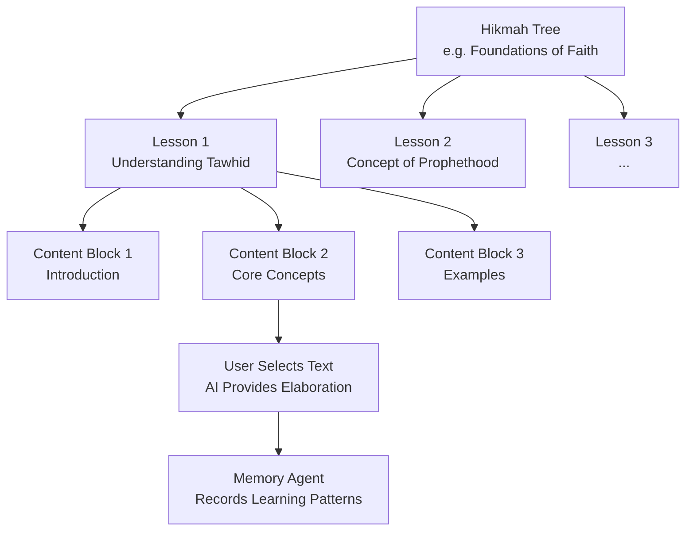
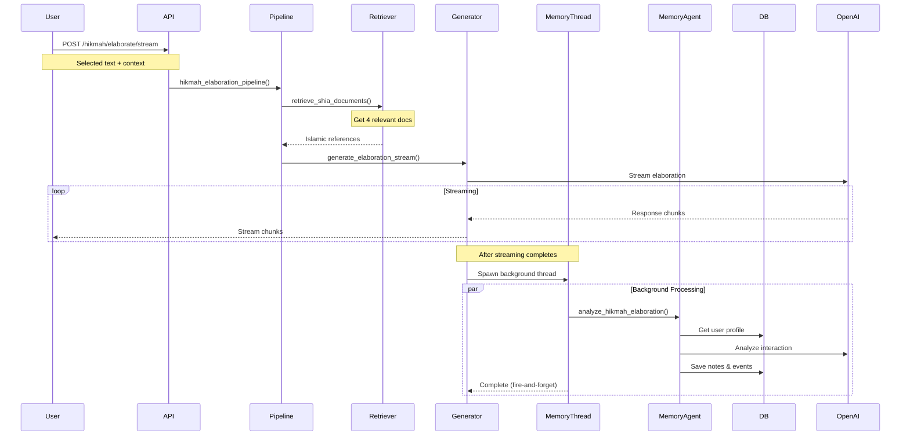

# Hikmah Trees - AI-Powered Courses and Lessons

Hikmah Trees are AI-powered educational courses that provide interactive learning experiences with context-aware elaboration features and integrated memory tracking.

## Table of Contents

- [Overview](#overview)
- [Concept](#concept)
- [Database Structure](#database-structure)
- [Elaboration Feature](#elaboration-feature)
- [Memory Integration](#memory-integration)
- [API Endpoints](#api-endpoints)
- [Usage Examples](#usage-examples)
- [User Progress Tracking](#user-progress-tracking)

## Overview

### What are Hikmah Trees?

Hikmah Trees (حكمة = wisdom) are structured learning paths that:
- Organize Islamic education into courses and lessons
- Provide AI-powered elaboration on selected text
- Track user progress and engagement
- Integrate with the memory agent to personalize learning
- Adapt to individual learning patterns

### Key Features

- **Structured Learning** - Hierarchical course organization
- **Interactive Elaboration** - AI explains selected passages on-demand
- **Context-Aware** - Elaborations consider the full lesson context
- **Memory Integration** - Learns from what users find confusing
- **Progress Tracking** - Tracks completion and engagement
- **Streaming Responses** - Real-time elaboration delivery

## Concept

### Learning Hierarchy



### Educational Flow

1. **User browses** Hikmah Tree catalog
2. **Selects lesson** from a tree
3. **Reads content** block by block
4. **Selects confusing text** for elaboration
5. **Receives AI explanation** with sources
6. **Memory agent** records what they struggled with
7. **System adapts** future recommendations

## Database Structure

### Core Tables

#### hikmah_trees

**File**: `db/models/hikmah_trees.py`

```python
class HikmahTree(Base):
    __tablename__ = "hikmah_trees"
    
    id = Column(BigInteger, primary_key=True, autoincrement=True)
    title = Column(Text)                    # "Foundations of Shia Faith"
    summary = Column(Text)                  # Brief description
    tags = Column(ARRAY(Text))              # ["theology", "basics", "aqeedah"]
    skill_level = Column(Integer)           # 1-10 (1=beginner, 10=advanced)
    meta = Column(JSONB)                    # Additional metadata
    created_at = Column(TIMESTAMP(timezone=True))
    updated_at = Column(TIMESTAMP(timezone=True))
```

**Example**:
```json
{
  "id": 1,
  "title": "Understanding Imamate",
  "summary": "Comprehensive study of the concept of Imamate in Shia Islam",
  "tags": ["imamate", "aqeedah", "theology"],
  "skill_level": 5,
  "meta": {
    "duration_hours": 8,
    "prerequisites": ["Foundations of Faith"]
  }
}
```

#### lessons

**File**: `db/models/lessons.py`

```python
class Lesson(Base):
    __tablename__ = "lessons"
    
    id = Column(BigInteger, primary_key=True)
    slug = Column(Text, unique=True)           # "understanding-tawhid"
    title = Column(Text, nullable=False)       # "Understanding Tawhid"
    summary = Column(Text)
    tags = Column(ARRAY(Text))                 # ["tawhid", "monotheism"]
    status = Column(Text)                      # "published", "draft"
    language_code = Column(Text)               # "en", "ar", "fa"
    author_user_id = Column(BigInteger)
    estimated_minutes = Column(Integer)        # 15 minutes
    published_at = Column(TIMESTAMP)
    hikmah_tree_id = Column(BigInteger)        # FK to hikmah_trees
    order_position = Column(Integer)           # Order within tree
    created_at = Column(TIMESTAMP)
    updated_at = Column(TIMESTAMP)
```

**Example**:
```json
{
  "id": 101,
  "slug": "imam-ali-wilayah",
  "title": "Imam Ali and the Concept of Wilayah",
  "summary": "Exploring the authority of Imam Ali",
  "tags": ["imam-ali", "wilayah", "imamate"],
  "status": "published",
  "hikmah_tree_id": 1,
  "order_position": 3,
  "estimated_minutes": 20
}
```

#### lesson_content

**File**: `db/models/lesson_content.py`

```python
class LessonContent(Base):
    __tablename__ = "lesson_content"
    
    id = Column(BigInteger, primary_key=True)
    lesson_id = Column(BigInteger)             # FK to lessons
    content_type = Column(Text)                # "text", "video", "quiz"
    content = Column(Text)                     # Main content
    order_position = Column(Integer)           # Order within lesson
    meta = Column(JSONB)                       # Additional data
    created_at = Column(TIMESTAMP)
    updated_at = Column(TIMESTAMP)
```

**Example**:
```json
{
  "id": 1001,
  "lesson_id": 101,
  "content_type": "text",
  "order_position": 1,
  "content": "Wilayah is a fundamental concept in Shia Islam that refers to the divine authority and guardianship of the Imams...",
  "meta": {
    "difficulty": "intermediate",
    "key_concepts": ["wilayah", "divine_authority"]
  }
}
```

#### user_progress

**File**: `db/models/user_progress.py`

```python
class UserProgress(Base):
    __tablename__ = "user_progress"
    
    id = Column(BigInteger, primary_key=True)
    user_id = Column(String(128), index=True)
    hikmah_tree_id = Column(BigInteger)
    lesson_id = Column(BigInteger)
    content_id = Column(BigInteger)
    is_completed = Column(Boolean)
    percent_complete = Column(Numeric(5,2))    # 0.00 - 100.00
    last_position = Column(Integer)
    notes = Column(Text)                       # User notes
    meta = Column(JSONB)                       # Engagement data
    updated_at = Column(TIMESTAMP)
    created_at = Column(TIMESTAMP)
```

## Elaboration Feature

### How It Works

When a user selects text within a lesson, the system:

1. **Receives request** with selected text and context
2. **Retrieves** relevant Islamic references from Pinecone
3. **Generates** context-aware elaboration via GPT-4
4. **Streams** response to user in real-time
5. **Triggers** memory agent in background (if user_id provided)
6. **Records** what user found confusing for future personalization

### Elaboration Pipeline



### Code Implementation

**File**: `core/pipeline.py`

```python
def hikmah_elaboration_pipeline_streaming(
    selected_text: str,
    context_text: str,
    hikmah_tree_name: str,
    lesson_name: str,
    lesson_summary: str,
    user_id: str = None
):
    # Step 1: Retrieve relevant documents (Shia sources only)
    relevant_shia_docs = retriever.retrieve_shia_documents(context_text, 4)
    
    # Step 2: Stream elaboration response
    response_generator = stream_generator.generate_elaboration_response_stream(
        selected_text=selected_text,
        context_text=context_text,
        hikmah_tree_name=hikmah_tree_name,
        lesson_name=lesson_name,
        lesson_summary=lesson_summary,
        retrieved_docs=relevant_shia_docs,
        user_id=user_id  # Triggers memory agent if provided
    )
    
    return StreamingResponse(response_generator, media_type="text/event-stream")
```

**File**: `modules/generation/stream_generator.py`

```python
def generate_elaboration_response_stream(
    selected_text: str,
    context_text: str,
    hikmah_tree_name: str,
    lesson_name: str,
    lesson_summary: str,
    retrieved_docs: list,
    user_id: Optional[str] = None
):
    # Format references
    references = utils.compact_format_references(retrieved_docs)
    
    # Use elaboration-specific prompt
    prompt = prompt_templates.hikmah_elaboration_prompt_template
    chain = prompt | chat_model
    
    ai_response_chunks = []
    
    # Stream chunks to client
    for chunk in chain.stream({
        "selected_text": selected_text,
        "context_text": context_text,
        "hikmah_tree_name": hikmah_tree_name,
        "lesson_name": lesson_name,
        "lesson_summary": lesson_summary,
        "references": references
    }):
        content = getattr(chunk, "content", "")
        
        if user_id:
            ai_response_chunks.append(content)
        
        yield content
    
    # After streaming, trigger memory update in background thread
    if user_id:
        thread = threading.Thread(
            target=_run_memory_update_sync,
            args=(user_id, selected_text, hikmah_tree_name, lesson_name),
            daemon=True
        )
        thread.start()
```

### Elaboration Prompt

The elaboration prompt instructs the AI to:

1. **Explain the selected text** in the context of the full lesson
2. **Use retrieved references** to support explanations
3. **Keep Shia perspective** in theological explanations
4. **Be pedagogical** - explain like a teacher
5. **Avoid repetition** of lesson content already provided

Location: `core/prompt_templates.py` (`hikmah_elaboration_prompt_template`)

## Memory Integration

### What Gets Tracked

When a user requests elaboration, the memory agent analyzes:

1. **What they selected** - Indicates what they didn't understand
2. **Lesson context** - What topic/level they're studying
3. **Frequency** - Do they repeatedly ask about same concepts?
4. **Pattern** - What types of content confuse them?

### Note Categories

The memory agent can create:

**Learning Notes**:
- "User is studying lesson on Imamate in 'Understanding Shia Faith' tree"
- "User consistently asks for elaboration on theological concepts"

**Knowledge Notes**:
- "User struggles with understanding the concept of Wilayah"
- "User has strong foundation in prayer rituals but gaps in Aqeedah"

**Interest Notes**:
- "User shows high interest in Imam Ali's teachings"
- "User frequently explores lessons on early Islamic history"

**Behavior Notes**:
- "User prefers detailed explanations over summaries"
- "User often requests elaboration on abstract concepts"

### Duplicate Prevention

The system prevents redundant notes:

```python
# If user asks about "Wilayah" multiple times:
# First request: Creates note "User needs clarification on Wilayah"
# Second request: Skipped (duplicate detected)
# Third request: Skipped (duplicate detected)
```

This is handled by the `MemoryConsolidator` which checks existing notes before adding new ones.

### Background Processing

Memory updates happen in a **separate background thread**:

- ✅ **Non-blocking** - User gets elaboration immediately
- ✅ **Independent** - Memory failure doesn't affect elaboration
- ✅ **Thread-safe** - Each thread has its own DB session
- ✅ **Fire-and-forget** - No waiting for memory update

```python
# User receives elaboration: ~2 seconds
# Memory processing: ~3-5 seconds (in background)
# Total user-perceived latency: ~2 seconds
```

## API Endpoints

### POST /hikmah/elaborate/stream

**Authentication**: Required (JWT Bearer token)

**Request Body**:

```json
{
  "selected_text": "What is Taqwa?",
  "context_text": "Taqwa is a fundamental concept in Islam. It refers to God-consciousness and is considered one of the highest virtues a believer can attain. The Quran frequently mentions taqwa as a quality of the righteous...",
  "hikmah_tree_name": "Foundations of Faith",
  "lesson_name": "Understanding Piety and Virtue",
  "lesson_summary": "This lesson explores the concept of piety (taqwa) and other virtues in Islamic teaching",
  "user_id": "user123"
}
```

**Parameters**:

| Field | Type | Required | Description |
|-------|------|----------|-------------|
| `selected_text` | string | Yes | Text user selected for elaboration |
| `context_text` | string | Yes | Full lesson context (for better understanding) |
| `hikmah_tree_name` | string | Yes | Name of the Hikmah Tree |
| `lesson_name` | string | Yes | Name of the current lesson |
| `lesson_summary` | string | Yes | Brief lesson summary |
| `user_id` | string | No | User ID (enables memory tracking) |

**Response**: Text stream (Server-Sent Events)

```
The concept of Taqwa, which you've highlighted, is indeed central to Islamic spirituality...

[continues streaming explanation]

It's important to note that in Shia tradition, the Imams are seen as exemplars of taqwa...

[completes streaming]
```

**Response Characteristics**:
- Real-time streaming
- Context-aware explanation
- References to Islamic sources
- Pedagogical tone
- Typically 200-500 words

### GET /hikmah-trees

**Authentication**: Required (JWT Bearer token)

**Description**: List all Hikmah Trees

**Response**:
```json
[
  {
    "id": 1,
    "title": "Foundations of Shia Faith",
    "summary": "Core beliefs and practices",
    "tags": ["aqeedah", "basics"],
    "skill_level": 3,
    "created_at": "2024-01-01T00:00:00Z"
  }
]
```

### GET /lessons?hikmah_tree_id={id}

**Authentication**: Required (JWT Bearer token)

**Description**: Get lessons for a specific Hikmah Tree

**Response**:
```json
[
  {
    "id": 101,
    "title": "Understanding Tawhid",
    "summary": "The concept of monotheism",
    "slug": "understanding-tawhid",
    "hikmah_tree_id": 1,
    "order_position": 1,
    "estimated_minutes": 15
  }
]
```

### GET /lesson-content?lesson_id={id}

**Authentication**: Required (JWT Bearer token)

**Description**: Get content blocks for a lesson

**Response**:
```json
[
  {
    "id": 1001,
    "lesson_id": 101,
    "content_type": "text",
    "content": "Tawhid is the concept of...",
    "order_position": 1
  }
]
```

### POST /user-progress

**Authentication**: Required (JWT Bearer token)

**Description**: Track user progress

**Request**:
```json
{
  "user_id": "user123",
  "lesson_id": 101,
  "is_completed": true,
  "percent_complete": 100.00
}
```

## Usage Examples

### Request Elaboration

```python
import requests

url = "http://localhost:8000/hikmah/elaborate/stream"
headers = {
    "Authorization": "Bearer YOUR_JWT_TOKEN",
    "Content-Type": "application/json"
}
data = {
    "selected_text": "the concept of Wilayah",
    "context_text": "In Shia Islam, Wilayah refers to the divine authority and guardianship of the Prophet and the Imams. This concept is fundamental to understanding the Shia belief in the continuation of divine guidance after the Prophet Muhammad...",
    "hikmah_tree_name": "Understanding Imamate",
    "lesson_name": "Imam Ali and Wilayah",
    "lesson_summary": "This lesson explores the authority of Imam Ali and the concept of Wilayah",
    "user_id": "user123"
}

response = requests.post(url, json=data, headers=headers, stream=True)

for chunk in response.iter_content(chunk_size=None, decode_unicode=True):
    print(chunk, end='', flush=True)
```

### Frontend Integration Example

```javascript
async function requestElaboration(selectedText, lessonContext) {
  const response = await fetch('/hikmah/elaborate/stream', {
    method: 'POST',
    headers: {
      'Authorization': `Bearer ${token}`,
      'Content-Type': 'application/json'
    },
    body: JSON.stringify({
      selected_text: selectedText,
      context_text: lessonContext.fullText,
      hikmah_tree_name: lessonContext.treeName,
      lesson_name: lessonContext.lessonName,
      lesson_summary: lessonContext.summary,
      user_id: currentUser.id
    })
  });
  
  const reader = response.body.getReader();
  const decoder = new TextDecoder();
  
  while (true) {
    const {done, value} = await reader.read();
    if (done) break;
    
    const chunk = decoder.decode(value);
    displayElaboration(chunk);  // Update UI incrementally
  }
}
```

## User Progress Tracking

### Tracking Metrics

The system can track:

1. **Completion Status** - Is lesson/tree completed?
2. **Progress Percentage** - How far through the lesson?
3. **Last Position** - Where did user leave off?
4. **Time Spent** - Engagement duration
5. **Elaboration Requests** - What confused them?
6. **Notes** - User's own notes on lessons

### Progress API

```python
# Mark lesson as completed
POST /user-progress
{
  "user_id": "user123",
  "lesson_id": 101,
  "is_completed": true,
  "percent_complete": 100.00,
  "meta": {
    "time_spent_minutes": 18,
    "elaborations_requested": 3
  }
}

# Get user's progress
GET /user-progress?user_id=user123&hikmah_tree_id=1
```

### Adaptive Recommendations

Future enhancement: Use progress + memory data to:
- Suggest next lessons based on interests
- Adjust difficulty based on understanding
- Recommend review of confusing concepts
- Personalize elaboration depth

## Best Practices

### For Content Creators

1. **Structure lessons** into digestible blocks (5-10 min each)
2. **Add rich context** for better elaborations
3. **Tag appropriately** for discovery
4. **Set skill levels** accurately (1-10 scale)
5. **Include summaries** to help AI understand lesson goals

### For Frontend Developers

1. **Show streaming** - Don't wait for full response
2. **Highlight selected text** - Clear what's being elaborated
3. **Cache elaborations** - Same selection = same elaboration
4. **Track progress** - Update backend on completion
5. **Handle errors gracefully** - Elaboration can fail

### For Backend Developers

1. **Keep context focused** - Don't send entire course to API
2. **Limit context length** - ~800 chars max for context_text
3. **Use user_id** - Enable memory tracking
4. **Monitor memory agent** - Check logs for successful updates
5. **Handle threading** - Memory agent runs independently

## Performance

### Elaboration Response Time

- **First Token**: ~1.5-2 seconds
- **Full Response**: ~5-8 seconds (streamed)
- **User-Perceived**: ~1.5 seconds (streaming starts fast)

### Memory Processing

- **Background thread**: 3-5 seconds
- **Non-blocking**: User doesn't wait
- **Graceful failure**: Elaboration works even if memory fails

## See Also

- [Memory Agent Documentation](MEMORY_AGENT.md) - How learning patterns are tracked
- [Chatbot Documentation](CHATBOT.md) - Similar RAG pipeline
- [API Reference](API_REFERENCE.md) - Complete API documentation
- [Database Documentation](DATABASE.md) - Schema details
