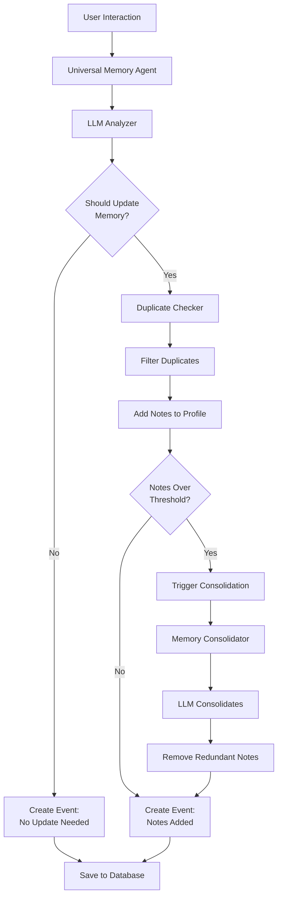
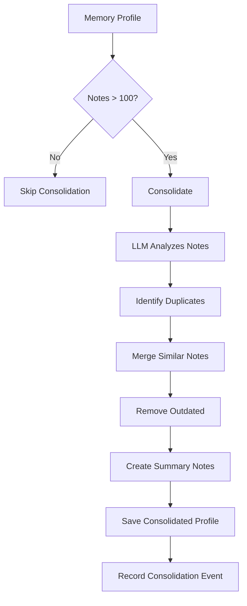

# Memory Agent - Adaptive Learning System

The Universal Memory Agent is an intelligent system that learns from user interactions to personalize the learning experience. It analyzes chat conversations, lesson completions, elaboration requests, and other interactions to build a comprehensive understanding of each user's learning journey.

## Table of Contents

- [Overview](#overview)
- [Architecture](#architecture)
- [Interaction Types](#interaction-types)
- [Note Categories](#note-categories)
- [Memory Consolidation](#memory-consolidation)
- [Duplicate Prevention](#duplicate-prevention)
- [Background Processing](#background-processing)
- [Database Models](#database-models)
- [Memory Admin Dashboard](#memory-admin-dashboard)
- [API Endpoints](#api-endpoints)
- [Usage Examples](#usage-examples)

## Overview

### Purpose

The Memory Agent addresses the question: **"How can we personalize learning without explicit user input?"**

Instead of asking users to fill out questionnaires, the agent:
- **Observes** natural interactions
- **Analyzes** patterns and behaviors
- **Extracts** meaningful insights
- **Stores** structured memory notes
- **Adapts** future recommendations

### Key Features

- **Universal** - Handles any type of interaction (chat, lessons, quizzes, etc.)
- **Intelligent** - Uses GPT-4 to analyze interactions
- **Non-intrusive** - Works in background without user awareness
- **Structured** - Organizes memory into 5 clear categories
- **Self-managing** - Automatically consolidates to prevent bloat
- **Duplicate-aware** - Prevents redundant notes

### Real-World Example

```
User requests elaboration on "Wilayah" in an Imamate lesson.

Memory Agent observes:
  ✓ User is studying intermediate-level theology
  ✓ User struggles with abstract Shia concepts
  ✓ User frequently asks about Imam Ali

Memory Agent creates notes:
  📝 Learning: "User is studying Imamate concepts in depth"
  📝 Knowledge: "User needs clarification on Wilayah concept"
  📝 Interest: "User shows strong interest in Imam Ali's teachings"

Next time:
  → System can provide simpler Wilayah explanations
  → System can recommend more Imam Ali content
  → System can adjust complexity for this user
```

## Architecture

### System Components



### Core Classes

**UniversalMemoryAgent** (`agents/core/universal_memory_agent.py`)
- Main agent class
- Analyzes interactions
- Manages memory updates
- Triggers consolidation

**MemoryConsolidator** (`agents/core/memory_consolidator.py`)
- Prevents duplicate notes
- Consolidates memory when full
- Merges similar observations

**MemoryService** (`services/memory_service.py`)
- Handles database operations
- Transaction management
- Repository coordination

## Interaction Types

The agent is **interaction-agnostic** and can process any user interaction:

### Supported Interaction Types

```python
class InteractionType(Enum):
    CHAT = "chat"
    HIKMAH_ELABORATION = "hikmah_elaboration"
    LESSON_COMPLETION = "lesson_completion"
    QUIZ_RESULT = "quiz_result"
    USER_FEEDBACK = "user_feedback"
    LEARNING_PATH_PROGRESS = "learning_path_progress"
    ASSESSMENT = "assessment"
    QUESTIONNAIRE = "questionnaire"
    CONTENT_RATING = "content_rating"
    STUDY_SESSION = "study_session"
```

### Current Integrations

#### 1. Hikmah Elaboration

**Triggered**: When user requests elaboration on lesson text

**Captures**:
- What concept confused them
- Which lesson they're studying
- What hikmah tree they're in

**Example Note**:
```json
{
  "content": "User needs clarification on the concept of Wilayah in Imamate",
  "evidence": "Requested elaboration on 'concept of Wilayah' in 'Imam Ali and Wilayah' lesson",
  "confidence": 0.85,
  "category": "learning_gap",
  "tags": ["wilayah", "imamate", "theology"],
  "note_type": "knowledge_notes"
}
```

**File**: `modules/generation/stream_generator.py` (background thread integration)

#### 2. Chat Conversations (Future)

**Triggers**: During chat interactions

**Captures**:
- Topics user asks about
- Depth of understanding
- Learning preferences

#### 3. Lesson Completion (Future)

**Triggers**: When user completes a lesson

**Captures**:
- What they studied
- Time spent
- Engagement level

### Adding New Interaction Types

To add a new interaction type:

```python
# 1. Add to InteractionType enum
class InteractionType(Enum):
    NEW_TYPE = "new_type"

# 2. Call the agent
await memory_agent.analyze_interaction(
    user_id="user123",
    interaction_type=InteractionType.NEW_TYPE,
    interaction_data={
        "custom_field_1": "value",
        "custom_field_2": 123
    }
)

# That's it! The universal agent handles the rest.
```

## Note Categories

Memory is organized into **5 categories**, each serving a specific purpose:

### 1. Learning Notes

**Purpose**: Track what user is currently studying and learning

**Examples**:
- "User is studying intermediate-level Aqeedah (theology)"
- "User completed Introduction to Imamate lesson"
- "User consistently engages with historical content"

**Use Cases**:
- Recommend next lessons
- Track learning path progress
- Identify current focus areas

### 2. Knowledge Notes

**Purpose**: Track what user knows well vs. struggles with

**Examples**:
- "User has strong understanding of prayer rituals"
- "User struggles with abstract theological concepts"
- "User needs more explanation on Wilayah concept"

**Use Cases**:
- Adjust content complexity
- Identify knowledge gaps
- Personalize explanations

### 3. Interest Notes

**Purpose**: Track topics that engage the user

**Examples**:
- "User shows strong interest in Imam Ali's teachings"
- "User frequently explores lessons on early Islamic history"
- "User engages deeply with social justice topics in Islam"

**Use Cases**:
- Content recommendations
- Personalized suggestions
- Engagement optimization

### 4. Behavior Notes

**Purpose**: Track learning patterns and habits

**Examples**:
- "User prefers detailed explanations over summaries"
- "User often requests elaboration on abstract concepts"
- "User tends to study in the evening (8-10 PM)"

**Use Cases**:
- Adapt presentation style
- Optimize content delivery
- Understand learning preferences

### 5. Preference Notes

**Purpose**: Track explicit preferences

**Examples**:
- "User prefers English language content"
- "User likes content with practical examples"
- "User appreciates comparative Shia/Sunni perspectives"

**Use Cases**:
- Format preferences
- Style preferences
- Content type preferences

### Note Structure

Each note includes:

```json
{
  "id": "uuid-here",
  "content": "User struggles with understanding Wilayah",
  "evidence": "Requested elaboration 3 times on Wilayah-related text",
  "confidence": 0.75,
  "category": "learning_gap",
  "tags": ["wilayah", "imamate", "theology", "advanced_concept"],
  "note_type": "knowledge_notes",
  "created_at": "2024-01-15T10:30:00Z"
}
```

**Fields**:
- `content`: The actual observation/insight
- `evidence`: What interaction data supports this
- `confidence`: 0.0-1.0 (AI's confidence in this observation)
- `category`: Subcategory for finer classification
- `tags`: Relevant topic tags
- `note_type`: Which category this belongs to
- `created_at`: When note was created

## Memory Consolidation

### Why Consolidation?

As users interact more, memory grows. Without management:
- Database bloat
- Slow LLM context loading
- Redundant information
- Outdated observations

### When Consolidation Triggers

**Automatic Trigger**: When total notes exceed **100** (configurable)

**Manual Trigger**: Can be triggered via API or admin dashboard

### Consolidation Process



### Consolidation Logic

**File**: `agents/core/memory_consolidator.py`

```python
async def consolidate_user_memory(
    self,
    memory_profile: UserMemoryProfile,
    consolidation_type: str = "automatic"
) -> Dict:
    # Count notes before
    notes_before = self._count_total_notes(memory_profile)
    
    # LLM analyzes and consolidates each category
    for category in ["learning_notes", "knowledge_notes", ...]:
        original_notes = getattr(memory_profile, category)
        
        # Ask LLM to consolidate
        consolidated = await self._consolidate_category(original_notes)
        
        # Update profile
        setattr(memory_profile, category, consolidated)
    
    # Count notes after
    notes_after = self._count_total_notes(memory_profile)
    
    # Record consolidation event
    self.consolidation_service.create_consolidation_record(
        profile_id=memory_profile.id,
        consolidation_type=consolidation_type,
        notes_before_count=notes_before,
        notes_after_count=notes_after,
        reasoning="LLM's explanation..."
    )
    
    return {
        "notes_before": notes_before,
        "notes_after": notes_after,
        "notes_removed": notes_before - notes_after
    }
```

### What Gets Consolidated

1. **Duplicate Notes**
   - "User struggles with Wilayah" (day 1)
   - "User needs help understanding Wilayah" (day 3)
   - → Merged into single note

2. **Similar Observations**
   - "User interested in Imam Ali"
   - "User frequently reads about Imam Ali"
   - "User engages with Imam Ali content"
   - → Merged into comprehensive note

3. **Outdated Information**
   - "User is beginner level" (3 months ago)
   - "User demonstrates intermediate understanding" (recent)
   - → Remove outdated, keep recent

4. **Summary Creation**
   - Multiple related notes
   - → Single high-level summary note

## Duplicate Prevention

### Why It Matters

Without duplicate prevention:
```
User asks about Wilayah: "User needs clarification on Wilayah"
User asks about Wilayah again: "User struggles with Wilayah concept"
User asks about Wilayah 3rd time: "User wants explanation of Wilayah"
User asks about Wilayah 4th time: "User confused about Wilayah"
...100 notes saying the same thing
```

### How It Works

**File**: `agents/core/memory_consolidator.py`

```python
async def check_for_duplicates_before_adding(
    self,
    memory_profile: UserMemoryProfile,
    proposed_notes: List[Dict]
) -> List[Dict]:
    """
    Check if proposed notes are duplicates of existing notes.
    Returns only non-duplicate notes.
    """
    
    # Get existing notes
    existing_notes = self._collect_all_notes(memory_profile)
    
    # For each proposed note
    filtered_notes = []
    for proposed in proposed_notes:
        # Ask LLM: Is this a duplicate?
        is_duplicate = await self._is_duplicate(proposed, existing_notes)
        
        if not is_duplicate:
            filtered_notes.append(proposed)
        else:
            logger.info(f"Skipping duplicate note: {proposed['content']}")
    
    return filtered_notes
```

### Duplicate Detection

The LLM checks:
1. **Semantic Similarity** - Same meaning, different words?
2. **Topic Overlap** - About the same concept?
3. **Evidence Similarity** - From similar interactions?

**Example**:
```python
Existing: "User struggles with understanding Wilayah in Shia theology"
Proposed: "User needs clarification on the concept of Wilayah"
LLM Decision: DUPLICATE (same concept, same struggle)
Action: Skip adding proposed note
```

## Background Processing

### Why Background?

Memory processing takes 3-5 seconds. Without background processing:
- User waits 5+ seconds for elaboration
- Bad UX
- Perceived slowness

With background processing:
- User gets elaboration in 1.5 seconds
- Memory updates happen invisibly
- Smooth UX

### Implementation

**File**: `modules/generation/stream_generator.py`

```python
def generate_elaboration_response_stream(..., user_id: Optional[str] = None):
    # Stream response to user
    for chunk in chain.stream({...}):
        yield chunk
    
    # AFTER streaming completes, spawn background thread
    if user_id:
        thread = threading.Thread(
            target=_run_memory_update_sync,
            args=(user_id, selected_text, hikmah_tree_name, lesson_name),
            daemon=True  # Daemon thread won't block shutdown
        )
        thread.start()
        print(f"🧠 Memory agent thread started for user {user_id}")

def _run_memory_update_sync(user_id, selected_text, hikmah_tree_name, lesson_name):
    """Runs in separate thread with its own event loop"""
    try:
        # Create new event loop for this thread
        loop = asyncio.new_event_loop()
        asyncio.set_event_loop(loop)
        
        # Run async memory update
        loop.run_until_complete(_update_hikmah_memory(...))
        
        loop.close()
    except Exception as e:
        print(f"❌ Error in memory update: {e}")
```

### Thread Safety

Each background thread has:
- **Own event loop** - No conflicts with main loop
- **Own DB session** - No connection sharing issues
- **Error isolation** - Failure doesn't affect user response
- **Auto-cleanup** - Session closed in finally block

```python
async def _update_hikmah_memory(user_id, ...):
    db = None
    try:
        # Create fresh DB session for this thread
        db = SessionLocal()
        
        # Initialize agent with session
        memory_agent = UniversalMemoryAgent(db)
        
        # Analyze interaction
        result = await memory_agent.analyze_hikmah_elaboration(...)
        
        print(f"✅ Memory updated for user {user_id}")
        
    except Exception as e:
        print(f"❌ Error: {e}")
    
    finally:
        # Always close DB session
        if db is not None:
            db.close()
```

## Database Models

### UserMemoryProfile

**File**: `agents/models/user_memory_models.py`

```python
class UserMemoryProfile(Base):
    __tablename__ = "user_memory_profiles"
    
    id = Column(String, primary_key=True)
    user_id = Column(String, unique=True, nullable=False, index=True)
    
    # Memory storage (JSON arrays)
    learning_notes = Column(JSON, default=list)
    interest_notes = Column(JSON, default=list)
    knowledge_notes = Column(JSON, default=list)
    behavior_notes = Column(JSON, default=list)
    preference_notes = Column(JSON, default=list)
    
    # Metadata
    total_interactions = Column(Integer, default=0)
    last_significant_update = Column(DateTime)
    memory_version = Column(Integer, default=1)
    
    created_at = Column(DateTime, default=datetime.utcnow)
    updated_at = Column(DateTime, default=datetime.utcnow)
```

### MemoryEvent

Tracks each interaction that was analyzed:

```python
class MemoryEvent(Base):
    __tablename__ = "memory_events"
    
    id = Column(String, primary_key=True)
    user_memory_profile_id = Column(String, ForeignKey("user_memory_profiles.id"))
    
    # Event details
    event_type = Column(String)  # "hikmah_elaboration", "chat", etc.
    event_data = Column(JSON)    # Original interaction data
    trigger_context = Column(JSON)
    
    # Processing results
    notes_added = Column(JSON)   # Which notes were added
    processing_reasoning = Column(Text)  # LLM's reasoning
    processing_status = Column(String)   # "pending", "processed", "failed"
    
    created_at = Column(DateTime)
    processed_at = Column(DateTime)
```

### MemoryConsolidation

Tracks consolidation operations:

```python
class MemoryConsolidation(Base):
    __tablename__ = "memory_consolidations"
    
    id = Column(String, primary_key=True)
    user_memory_profile_id = Column(String, ForeignKey("user_memory_profiles.id"))
    
    # Consolidation details
    consolidation_type = Column(String)  # "automatic", "manual", "emergency"
    notes_before_count = Column(Integer)
    notes_after_count = Column(Integer)
    
    # What changed
    consolidated_notes = Column(JSON)    # Notes that were merged
    removed_notes = Column(JSON)         # Notes that were removed
    new_summary_notes = Column(JSON)     # Summary notes created
    
    consolidation_reasoning = Column(Text)  # LLM's explanation
    created_at = Column(DateTime)
```

## Memory Admin Dashboard

### Overview

Interactive web UI for developers to inspect and debug the memory system.

**Access**: `http://localhost:8000/admin/memory/dashboard`

**No Authentication Required** - It's a developer tool

### Features

#### 1. User Lookup

- Enter any `user_id` to load their memory profile
- Displays instantly upon clicking "Load"

#### 2. Summary Cards

Shows at-a-glance information:
- **User ID**
- **Total Notes** (across all categories)
- **Memory Version**
- **Last Update** timestamp
- **Note Counts** by category

Example:
```
┌─────────────────────────────────────────┐
│ User: user123                           │
│ Total Notes: 47                         │
│ Memory Version: 3                       │
│ Last Update: Jan 15, 2024 10:30 AM     │
│                                         │
│ learning_notes: 12                      │
│ knowledge_notes: 15                     │
│ interest_notes: 10                      │
│ behavior_notes: 7                       │
│ preference_notes: 3                     │
└─────────────────────────────────────────┘
```

#### 3. Notes Tab

Browse all notes organized by category:

**learning_notes Section**:
```
┌──────────────────────────────────────────────────────────────┐
│ learning_notes (12)                                          │
│ What the user has studied, learned, or is currently learning│
│                                                              │
│ Content         │ Category      │ Conf. │ Tags             │
│─────────────────│───────────────│───────│──────────────────│
│ User studying   │ learning_     │ 0.85  │ imamate,        │
│ intermediate    │ progress      │       │ theology         │
│ Imamate...      │               │       │                  │
└──────────────────────────────────────────────────────────────┘
```

Similar sections for:
- knowledge_notes
- interest_notes
- behavior_notes
- preference_notes

#### 4. Events Tab

View recent memory events:

```
┌─────────────────────────────────────────────────────────────┐
│ Recent Events                                               │
│                                                             │
│ Type              │ Status    │ Processed      │ Notes     │
│───────────────────│───────────│────────────────│───────────│
│ hikmah_elabor...  │ processed │ Jan 15, 10:30  │ 2         │
│ hikmah_elabor...  │ processed │ Jan 15, 10:15  │ 1         │
│ hikmah_elabor...  │ processed │ Jan 15, 9:45   │ 0 (dup)   │
└─────────────────────────────────────────────────────────────┘
```

Shows:
- Event type
- Processing status (pending/processed/failed)
- When processed
- How many notes added
- LLM's reasoning

#### 5. Consolidations Tab

View consolidation history:

```
┌─────────────────────────────────────────────────────────────┐
│ Consolidations                                              │
│                                                             │
│ Date          │ Type      │ Notes (before→after) │ Removed │
│───────────────│───────────│──────────────────────│─────────│
│ Jan 14, 3:00  │ automatic │ 105 → 78             │ 27      │
│ Jan 10, 2:15  │ automatic │ 102 → 85             │ 17      │
└─────────────────────────────────────────────────────────────┘
```

Shows:
- When consolidation happened
- Type (automatic/manual)
- Note count changes
- How many removed
- LLM's reasoning for consolidation

### Implementation

**File**: `api/memory_admin.py`

```python
@router.get("/dashboard", response_class=HTMLResponse)
def dashboard():
    """Lightweight dev dashboard for inspecting memory data"""
    # Returns self-contained HTML with JavaScript
    # Uses fetch() to call JSON endpoints below
    pass

@router.get("/{user_id}/profile")
def profile(user_id: str, db: Session = Depends(get_db)):
    """JSON endpoint: User profile summary"""
    pass

@router.get("/{user_id}/notes")
def notes(user_id: str, db: Session = Depends(get_db)):
    """JSON endpoint: All notes by category"""
    pass

@router.get("/{user_id}/events")
def events(user_id: str, limit: int = 50, db: Session = Depends(get_db)):
    """JSON endpoint: Recent events"""
    pass

@router.get("/{user_id}/consolidations")
def consolidations(user_id: str, limit: int = 20, db: Session = Depends(get_db)):
    """JSON endpoint: Consolidation history"""
    pass
```

### Using the Dashboard

**Step 1**: Start your backend
```bash
uvicorn main:app --reload
```

**Step 2**: Navigate to dashboard
```
http://localhost:8000/admin/memory/dashboard
```

**Step 3**: Enter a user_id and click "Load"

**Step 4**: Browse tabs to inspect:
- Notes - What the system has learned
- Events - What interactions were processed
- Consolidations - When memory was cleaned up

### Use Cases

**Debugging**:
- Why did the system create this note?
- Did my interaction get processed?
- Are duplicates being prevented?

**Development**:
- Test memory agent behavior
- Verify note creation logic
- Check consolidation triggers

**Monitoring**:
- How much memory per user?
- Are consolidations working?
- Any failed events?

## API Endpoints

### Programmatic Access

The dashboard uses these JSON endpoints, which you can also call directly:

```bash
# Get user profile summary
curl http://localhost:8000/admin/memory/user123/profile

# Get all notes for a user
curl http://localhost:8000/admin/memory/user123/notes

# Get recent events
curl http://localhost:8000/admin/memory/user123/events?limit=50

# Get consolidation history
curl http://localhost:8000/admin/memory/user123/consolidations?limit=20
```

## Usage Examples

### Analyzing a Hikmah Elaboration

```python
from agents.core.universal_memory_agent import UniversalMemoryAgent, InteractionType
from db.session import SessionLocal

# Create DB session
db = SessionLocal()

# Initialize agent
memory_agent = UniversalMemoryAgent(db)

# Analyze elaboration request
result = await memory_agent.analyze_interaction(
    user_id="user123",
    interaction_type=InteractionType.HIKMAH_ELABORATION,
    interaction_data={
        "selected_text": "the concept of Wilayah",
        "hikmah_tree_name": "Understanding Imamate",
        "lesson_name": "Imam Ali and Wilayah"
    }
)

print(f"Memory updated: {result['memory_updated']}")
print(f"Reasoning: {result['reasoning']}")
print(f"Notes added: {len(result['notes_added'])}")

# Close session
db.close()
```

### Manually Triggering Consolidation

```python
from agents.core.memory_consolidator import MemoryConsolidator
from services.consolidation_service import ConsolidationService

# Initialize consolidator
consolidation_service = ConsolidationService(db)
consolidator = MemoryConsolidator(consolidation_service)

# Get user profile
profile = memory_service.get_or_create_profile("user123")

# Consolidate
result = await consolidator.consolidate_user_memory(profile, "manual")

print(f"Notes before: {result['notes_before']}")
print(f"Notes after: {result['notes_after']}")
print(f"Notes removed: {result['notes_removed']}")
```

### Checking for Duplicates

```python
# Proposed notes from LLM
proposed_notes = [
    {
        "content": "User struggles with Wilayah concept",
        "category": "learning_gap",
        "note_type": "knowledge_notes"
    }
]

# Check for duplicates
filtered_notes = await consolidator.check_for_duplicates_before_adding(
    memory_profile=profile,
    proposed_notes=proposed_notes
)

print(f"Proposed: {len(proposed_notes)}")
print(f"After filtering: {len(filtered_notes)}")
```

## Configuration

### Environment Variables

```bash
# Memory Agent (uses LLM models from core config)
LARGE_LLM=gpt-4o              # For analysis and consolidation
SMALL_LLM=gpt-4o-mini         # Not used by memory agent

# Database (shared with main app)
DATABASE_URL=postgresql://...
```

### Tunable Parameters

**In Code** (`agents/core/memory_consolidator.py`):

```python
# Consolidation threshold
CONSOLIDATION_THRESHOLD = 100  # Trigger when notes exceed this

# Duplicate similarity threshold
DUPLICATE_THRESHOLD = 0.8  # 0.0-1.0 (how similar = duplicate)
```

## Best Practices

### For Developers

1. **Always provide user_id** when available - Enables memory tracking
2. **Monitor background threads** - Check logs for "✅ Memory updated"
3. **Use admin dashboard** - Verify memory agent is working
4. **Test with real interactions** - Agent learns better from actual use
5. **Don't over-query** - Memory agent is async, be patient

### For System Designers

1. **Design interaction types carefully** - What data is meaningful?
2. **Create specific note categories** - Better organization
3. **Set appropriate thresholds** - 100 notes is current sweet spot
4. **Monitor consolidation frequency** - Should happen every ~50-100 interactions
5. **Review LLM prompts** - Tweak for better note quality

### Privacy Considerations

1. **User consent** - Make users aware of memory tracking
2. **Data retention** - Implement policies for memory deletion
3. **Anonymization** - Consider anonymizing notes for analytics
4. **Access control** - Protect memory data appropriately
5. **GDPR compliance** - Allow users to view/delete their memory

## Troubleshooting

### Memory Not Updating

**Check**:
1. Is `user_id` provided in request?
2. Check server logs for "🧠 Memory agent thread started"
3. Check for "✅ Memory updated" or "❌ Error" messages
4. Verify database connection

**Solutions**:
- Ensure background threading is working
- Check database credentials
- Verify user_id is valid

### Too Many Duplicates

**Check**:
1. Is duplicate prevention working?
2. What's the similarity threshold?
3. Are notes too generic?

**Solutions**:
- Lower `DUPLICATE_THRESHOLD`
- Improve LLM prompts for specificity
- Manually consolidate memory

### Consolidation Not Triggering

**Check**:
1. How many notes does user have?
2. Is threshold set correctly?
3. Any errors in consolidation logic?

**Solutions**:
- Lower `CONSOLIDATION_THRESHOLD`
- Manually trigger consolidation
- Check consolidation logs

### Performance Issues

**Check**:
1. How many notes per user?
2. Consolidation frequency?
3. Database query performance?

**Solutions**:
- Increase consolidation frequency
- Optimize database indices
- Consider memory partitioning

## Future Enhancements

### Planned Features

1. **Memory-Based Recommendations**
   - Suggest lessons based on interests
   - Adjust difficulty based on knowledge gaps

2. **Adaptive Content**
   - Simplify explanations for weak areas
   - Add detail for interested topics

3. **Learning Analytics**
   - Visualize learning journey
   - Track knowledge growth
   - Identify struggling concepts

4. **Cross-User Patterns**
   - "Users who struggled with X also struggled with Y"
   - Optimize content based on aggregate memory

5. **Memory Export**
   - Allow users to download their memory
   - Privacy compliance

## See Also

- [Hikmah Trees Documentation](HIKMAH_TREES.md) - How memory integrates with lessons
- [Database Documentation](DATABASE.md) - Memory schema details
- [Architecture Documentation](ARCHITECTURE.md) - System design
- [API Reference](API_REFERENCE.md) - Memory API endpoints
