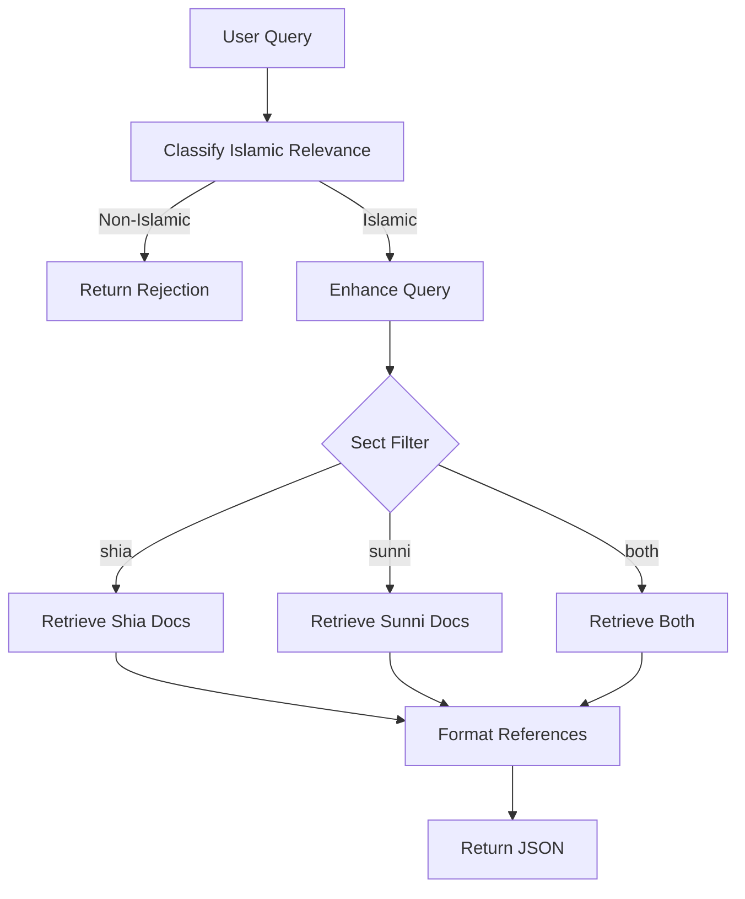

# Reference Lookup - Semantic Search for Islamic Texts

The reference lookup feature provides semantic search across Islamic texts, allowing users to find relevant Quranic verses, hadiths, and scholarly works from both Shia and Sunni sources.

## Table of Contents

- [Overview](#overview)
- [How It Works](#how-it-works)
- [Sect Filtering](#sect-filtering)
- [Hybrid Search](#hybrid-search)
- [API Endpoint](#api-endpoint)
- [Usage Examples](#usage-examples)
- [Reference Format](#reference-format)
- [Configuration](#configuration)

## Overview

### Purpose

The reference lookup feature allows users to:
- Search for Islamic texts related to specific topics
- Filter by sect (Shia, Sunni, or both)
- Control the number of results returned
- Get structured, source-cited references

### Key Features

- **Semantic Search** - Finds conceptually relevant texts, not just keyword matches
- **Hybrid Retrieval** - Combines dense and sparse embeddings for better results
- **Sect Filtering** - Query specific traditions or both
- **Configurable Limits** - Request 1-50 references
- **Rich Metadata** - Book, chapter, author, volume information included
- **Re-ranking** - Intelligently combines multiple retrieval strategies

## How It Works

### Pipeline Flow



### Code Flow

**File**: `core/pipeline.py` (`references_pipeline` function)

```python
def references_pipeline(user_query: str, sect: str, limit: int = REFERENCE_FETCH_COUNT):
    # 1. Classification
    is_non_islamic = classifier.classify_non_islamic_query(user_query)
    if is_non_islamic:
        return "This question is not related to the domain of Islamic education..."
    
    # 2. Enhancement
    enhanced_query = enhancer.enhance_query(user_query)
    
    # 3. Retrieval based on sect
    results = {}
    if sect in ["shia", "both"]:
        results["shia"] = format_references(
            retriever.retrieve_shia_documents(enhanced_query, limit)
        )
    if sect in ["sunni", "both"]:
        results["sunni"] = format_references(
            retriever.retrieve_sunni_documents(enhanced_query, limit)
        )
    
    return results
```

## Sect Filtering

### Supported Sects

The system can filter by:

1. **`shia`** - Only Shia Islamic sources
   - Al-Kafi
   - Tahdhib al-Ahkam
   - Man La Yahduruhu al-Faqih
   - Other Shia hadith collections

2. **`sunni`** - Only Sunni Islamic sources
   - Sahih al-Bukhari
   - Sahih Muslim
   - Sunan Abu Dawood
   - Other Sunni hadith collections

3. **`both`** - Sources from both traditions
   - Returns separate arrays for each sect
   - Useful for comparative study

### Implementation

**File**: `modules/retrieval/retriever.py`

```python
def retrieve_shia_documents(query, no_of_docs=10):
    # Dense retrieval with sect filter
    dense_docs = dense_vectorstore.similarity_search_with_score(
        query,
        filter={'sect': 'shia'},  # Pinecone metadata filter
        k=no_of_docs
    )
    
    # Sparse retrieval with sect filter
    sparse_docs = sparse_vectorstore.query(
        top_k=no_of_docs,
        sparse_vector=sparse_embedding,
        filter={'sect': 'shia'},  # Pinecone metadata filter
        namespace="ns1"
    )
    
    # Rerank and combine
    return reranker.rerank_documents(dense_docs, sparse_docs, no_of_docs)
```

### Filtering at Vector DB Level

Filtering happens at the Pinecone query level, which:
- **Reduces latency** (fewer docs to retrieve)
- **Improves accuracy** (more relevant docs in top-k)
- **Saves costs** (fewer vectors scanned)

## Hybrid Search

The reference lookup uses the same hybrid retrieval strategy as the chatbot:

### Dense Embeddings (Semantic)

- **Model**: OpenAI text-embedding-3-small
- **Dimension**: 1536
- **Use Case**: Finds conceptually similar texts

Example:
- Query: "justice in Islam"
- Matches: Texts about fairness, equality, rights (even if word "justice" isn't present)

### Sparse Embeddings (Keyword)

- **Algorithm**: BM25-style sparse vectors
- **Use Case**: Finds exact term matches

Example:
- Query: "Imam Ali"
- Matches: Texts mentioning "Imam Ali" or "Ali ibn Abi Talib"

### Re-ranking

**File**: `modules/reranking/reranker.py`

Combines both with weighted scores:

```python
# Default weights (configurable via env vars)
DENSE_WEIGHT = 0.8    # 80% semantic similarity
SPARSE_WEIGHT = 0.2   # 20% keyword matching

final_score = (dense_score * 0.8) + (sparse_score * 0.2)
```

This hybrid approach provides:
- **Semantic understanding** from dense embeddings
- **Precision** from sparse embeddings
- **Best of both worlds** through re-ranking

## API Endpoint

### POST /references

**Authentication**: Required (JWT Bearer token)

**Query Parameters**:

| Parameter | Type | Default | Options | Description |
|-----------|------|---------|---------|-------------|
| `sect` | string | `"both"` | `"shia"`, `"sunni"`, `"both"` | Filter by sect |
| `limit` | integer | `10` | `1-50` | Number of references to return |

**Request Body**:

```json
{
  "user_query": "What does Islam say about justice?"
}
```

**Response (sect=both)**:

```json
{
  "response": {
    "shia": [
      {
        "book": "Al-Kafi",
        "chapter": "Chapter on Justice",
        "hadith_number": "5",
        "text": "Al-Husayn ibn Muhammad has narrated...",
        "author": "Shaykh Muḥammad b. Yaʿqūb al-Kulaynī",
        "volume": "Volume 1",
        "source": "Shi'i Hadith"
      }
    ],
    "sunni": [
      {
        "book": "Sahih al-Bukhari",
        "chapter": "Book of Faith",
        "hadith_number": "13",
        "text": "Narrated by Abu Huraira...",
        "author": "Imam al-Bukhari",
        "volume": "Volume 1",
        "source": "Sunni Hadith"
      }
    ]
  }
}
```

**Response (sect=shia)**:

```json
{
  "response": {
    "shia": [
      {
        "book": "Al-Kafi",
        "chapter": "Chapter on Justice",
        "text": "...",
        "author": "Shaykh al-Kulaynī"
      }
    ]
  }
}
```

**Error Responses**:

```json
// Non-Islamic query
{
  "response": "This question is not related to the domain of Islamic education. Please ask relevant questions."
}

// Invalid sect parameter
{
  "detail": "Invalid value for 'sect'. Must be one of: shia, sunni, both"
}

// Invalid limit
{
  "detail": "Number of references must be between 1 and 50"
}
```

## Usage Examples

### Basic Request (Both Sects)

```bash
curl -X POST "http://localhost:8000/references?sect=both&limit=5" \
  -H "Authorization: Bearer YOUR_JWT_TOKEN" \
  -H "Content-Type: application/json" \
  -d '{
    "user_query": "charity in Islam"
  }'
```

### Shia Only

```bash
curl -X POST "http://localhost:8000/references?sect=shia&limit=10" \
  -H "Authorization: Bearer YOUR_JWT_TOKEN" \
  -H "Content-Type: application/json" \
  -d '{
    "user_query": "concept of Imamate"
  }'
```

### Python Example

```python
import requests

url = "http://localhost:8000/references"
headers = {
    "Authorization": "Bearer YOUR_JWT_TOKEN",
    "Content-Type": "application/json"
}
params = {
    "sect": "both",
    "limit": 10
}
data = {
    "user_query": "What is the importance of prayer?"
}

response = requests.post(url, params=params, json=data, headers=headers)
result = response.json()

# Access Shia references
shia_refs = result["response"]["shia"]
for ref in shia_refs:
    print(f"{ref['book']}: {ref['text'][:100]}...")

# Access Sunni references
sunni_refs = result["response"]["sunni"]
for ref in sunni_refs:
    print(f"{ref['book']}: {ref['text'][:100]}...")
```

### JavaScript Example

```javascript
const url = 'http://localhost:8000/references?sect=shia&limit=5';
const headers = {
  'Authorization': 'Bearer YOUR_JWT_TOKEN',
  'Content-Type': 'application/json'
};
const data = {
  user_query: 'justice in Islam'
};

fetch(url, {
  method: 'POST',
  headers: headers,
  body: JSON.stringify(data)
})
.then(response => response.json())
.then(result => {
  const references = result.response.shia;
  references.forEach(ref => {
    console.log(`${ref.book} - ${ref.chapter}`);
    console.log(ref.text);
  });
});
```

## Reference Format

### Metadata Fields

Each reference includes the following fields:

| Field | Type | Description | Example |
|-------|------|-------------|---------|
| `book` | string | Name of the source book | "Al-Kafi" |
| `chapter` | string | Chapter or section | "Chapter on Faith" |
| `hadith_number` | string | Hadith or verse number | "5" |
| `text` | string | Full text of the reference | "Al-Husayn ibn..." |
| `author` | string | Author of the source | "Shaykh al-Kulaynī" |
| `volume` | string | Volume information | "Volume 1" |
| `source` | string | Source category | "Shi'i Hadith" |
| `sect` | string | Sect classification | "shia" or "sunni" |

### Example Reference Structure

```json
{
  "book": "Al-Kafi",
  "chapter": "4 | The Book about people with Divine Authority",
  "hadith_number": "5",
  "text": "Al-Husayn ibn Muhammad has narrated from Mu'alla ibn Muhammad from Ahmad ibn Muhammad ibn 'Abd Allah from Ahmad ibn Muhammad ibn Abi Nasr from abu al-Hassan al-Rida (a.s.) who has said the following. \"The Imam is the person who when he speaks he tells you and when you ask him questions he informs you.\"",
  "author": "Shaykh Muḥammad b. Yaʿqūb al-Kulaynī",
  "volume": "NA",
  "source": "Volume 1",
  "sect": "shia"
}
```

### Text Length

- References include the **full text** of the hadith or passage
- Text lengths vary from ~100 to ~1000+ characters
- Frontend should handle text truncation/expansion as needed

## Configuration

### Environment Variables

```bash
# Default number of references (can be overridden by limit param)
REFERENCE_FETCH_COUNT=10

# Retrieval weights for re-ranking
DENSE_RESULT_WEIGHT=0.8    # Dense embedding weight
SPARSE_RESULT_WEIGHT=0.2   # Sparse embedding weight

# Pinecone configuration
PINECONE_API_KEY=your_api_key
DEEN_DENSE_INDEX_NAME=your_dense_index
DEEN_SPARSE_INDEX_NAME=your_sparse_index
```

### Adjustable Parameters

**Limit Parameter** (`limit`):
- **Range**: 1-50
- **Default**: 10 (from `REFERENCE_FETCH_COUNT`)
- **Recommendation**: 
  - 5-10 for quick lookups
  - 20-30 for comprehensive research
  - 50 for exhaustive search

**Retrieval Weights**:
- Adjust `DENSE_RESULT_WEIGHT` and `SPARSE_RESULT_WEIGHT` in `.env`
- Must sum to 1.0
- Current optimal: 0.8 dense, 0.2 sparse
- Higher dense weight: More conceptual matching
- Higher sparse weight: More exact term matching

## Performance

### Response Times

Typical latency breakdown:

| Stage | Time | Notes |
|-------|------|-------|
| Classification | ~500ms | Uses GPT-4o-mini |
| Enhancement | ~300ms | Uses GPT-4o-mini |
| Retrieval (Dense) | ~150ms | Pinecone query |
| Retrieval (Sparse) | ~150ms | Pinecone query |
| Re-ranking | ~50ms | Local computation |
| **Total** | **~1.2s** | For 10 references |

### Scaling Considerations

**Number of References**:
- More references = longer retrieval time (linear)
- 10 refs: ~1.2s
- 30 refs: ~1.5s
- 50 refs: ~1.8s

**Sect Filtering**:
- `both`: Slower (2x retrievals)
- `shia` or `sunni`: Faster (1x retrieval)

**Caching**:
- Pinecone caches frequently accessed vectors
- Repeated queries for similar topics are faster

## Comparison with Chatbot

### Reference Lookup vs. Chat

| Feature | Reference Lookup | Chat |
|---------|-----------------|------|
| **Purpose** | Find source texts | Get AI-generated answers |
| **Output** | Raw references | Interpreted response + refs |
| **Context** | No conversation history | Uses conversation memory |
| **Speed** | Faster (~1.2s) | Slower (~2-3s for first token) |
| **LLM Calls** | 2 (classify, enhance) | 4 (classify, enhance, generate, translate) |
| **Use Case** | Research, citations | Q&A, explanations |

### When to Use Reference Lookup

Use reference lookup when:
- User wants primary sources
- Research or academic use
- Citation needed
- No interpretation required
- Faster response preferred

### When to Use Chat

Use chat when:
- User wants explanation or interpretation
- Follow-up questions expected
- Multi-turn conversation
- Context awareness needed
- AI synthesis preferred

## Error Handling

### Common Errors

**Non-Islamic Query**:
```json
{
  "response": "This question is not related to the domain of Islamic education. Please ask relevant questions."
}
```

**No Results Found**:
```json
{
  "response": {
    "shia": [],
    "sunni": []
  }
}
```

**Pinecone Connection Error**:
```json
{
  "detail": "Internal Server Error"
}
```

### Troubleshooting

**Empty Results**:
- Check if query is too specific
- Try broader search terms
- Verify Pinecone index has data

**Classification False Positives**:
- Review classification prompt
- Add more context to query
- Test with `classify_non_islamic_query()` directly

**Slow Responses**:
- Reduce `limit` parameter
- Use single sect instead of `both`
- Check Pinecone dashboard for issues

## See Also

- [Chatbot Documentation](CHATBOT.md) - For conversational AI with references
- [AI Pipeline](AI_PIPELINE.md) - Detailed module documentation
- [API Reference](API_REFERENCE.md) - Complete API documentation
- [Architecture](ARCHITECTURE.md) - System design overview
