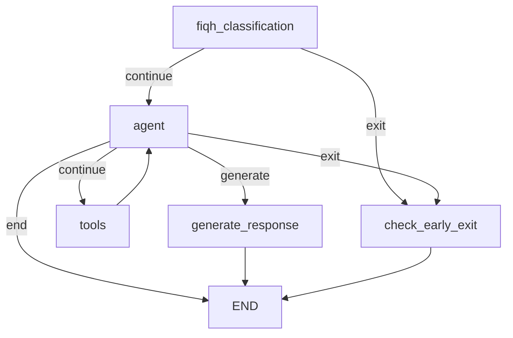

# Agentic Chatbot Architecture

This document explains how the `POST /chat/stream/agentic` and `POST /chat/agentic` APIs work in the current codebase.

It is based on the live implementation in:

- `api/chat.py`
- `core/pipeline_langgraph.py`
- `agents/core/chat_agent.py`
- `agents/state/chat_state.py`
- `agents/tools/*`
- `modules/*`
- `core/memory.py`
- `services/chat_persistence_service.py`

## 1. What This Agent Is

The agentic chatbot is a LangGraph-based orchestration layer on top of the existing Deen backend retrieval and generation stack.

At a high level, it does four things:

1. Receives a chat request from `/chat/stream/agentic` or `/chat/agentic`.
2. Runs a LangGraph workflow that decides whether to stop early, reformulate the working query, or retrieve source material.
3. Generates a final answer from retrieved references.
4. Streams or returns the answer, plus structured references and persistence side effects.

The agent is not a fully autonomous free-form multi-agent system. It is a single LangGraph state machine with:

- one LLM decision node,
- one tool execution node,
- a mandatory fiqh gate in front of the agent,
- an early-exit node,
- and a final-response node used only for non-streaming mode.

The current design goal is:

- always answer from the Twelver Shia perspective,
- default to Shia-first retrieval,
- add Sunni and/or Quran/Tafsir retrieval only when the query and current evidence make that useful,
- and use transcript memory explicitly rather than relying on implicit history writes during generation.

## 2. Entry Points

### Streaming path

`POST /chat/stream/agentic` in `api/chat.py` is the main production-style entry point.

Request fields:

- `user_query`
- `session_id`
- `language`
- optional `config`

Route behavior:

1. Validates `user_query` and `session_id`.
2. Optionally authenticates the user.
3. If authenticated:
   - hydrates Redis runtime history from the DB if Redis history is empty,
   - persists the new user message to the DB immediately.
4. Parses `config` into `AgentConfig` if present.
5. Calls `core.pipeline_langgraph.chat_pipeline_streaming_agentic(...)`.
6. If authenticated, wraps the SSE stream so the final assistant answer is saved to the DB.

### Non-streaming path

`POST /chat/agentic` is the simpler synchronous version.

It:

1. validates input,
2. parses optional config,
3. calls `core.pipeline_langgraph.chat_pipeline_agentic(...)`,
4. returns a JSON object with the final response and metadata.

## 3. End-to-End Architecture

```mermaid
flowchart TD
    A[Client] --> B[/chat/stream/agentic]
    B --> C[api/chat.py]
    C --> D[Optional auth + DB persistence]
    D --> E[core/pipeline_langgraph.py]
    E --> F[ChatAgent.astream]
    F --> G[LangGraph workflow]
    G --> H[Fiqh classification node]
    H -->|fiqh| I[Early-exit node]
    H -->|not fiqh| J[Agent node]
    J -->|tool calls| K[Tool node]
    K --> J
    J -->|agent decides evidence is sufficient| L[Graph ends in streaming mode]
    J -->|non-streaming only| M[Generate response node]
    L --> N[Pipeline-level response streaming]
    M --> O[JSON response]
    N --> P[SSE events + refs + done]
```

There are really two orchestration layers:

- the LangGraph workflow, which decides whether to exit or retrieve data,
- the outer pipeline in `core/pipeline_langgraph.py`, which is responsible for SSE formatting and, in streaming mode, final answer token streaming.

## 4. Main Runtime Components

### 4.1 `ChatAgent`

`agents/core/chat_agent.py` is the core orchestrator.

It is responsible for:

- creating the tool-calling LLM,
- building the `StateGraph`,
- compiling it with a LangGraph `MemorySaver`,
- exposing `invoke(...)` and `astream(...)`.

### 4.2 `ChatState`

`agents/state/chat_state.py` defines the state passed between nodes.

Important fields:

- conversation inputs:
  - `user_query`
  - `working_query`
  - `session_id`
  - `runtime_session_id`
  - `target_language`
  - `messages`
- classification:
  - `is_non_islamic`
  - `is_fiqh`
  - `classification_checked`
- enhancement / translation:
  - `enhanced_query`
  - `query_enhanced`
  - `is_translated`
  - `original_language`
- retrieval:
  - `retrieved_docs`
  - `quran_docs`
  - `retrieval_attempts`
  - `source_coverage`
  - `ready_to_answer`
  - `shia_docs_count`
  - `sunni_docs_count`
  - `quran_docs_count`
  - `retrieval_completed`
- output:
  - `final_response`
  - `response_generated`
  - `early_exit_message`
- flow control:
  - `iterations`
  - `should_end`
  - `streaming_mode`
  - `errors`
- config:
  - `config`

### 4.3 Tool set

The agent binds these tools:

- `check_if_non_islamic_tool`
- `translate_to_english_tool`
- `enhance_query_tool`
- `retrieve_shia_documents_tool`
- `retrieve_sunni_documents_tool`
- `retrieve_quran_tafsir_tool`

Notably:

- fiqh classification is no longer exposed to the agent as a bound tool because it is already hard-gated before the agent node,
- and combined retrieval is not bound to the agent anymore so it must choose Shia, Sunni, and Quran/Tafsir retrieval deliberately.

### 4.4 Retrieval / generation modules

The graph does not perform retrieval itself. It delegates to existing modules:

- classification: `modules/classification/classifier.py`
- enhancement: `modules/enhancement/enhancer.py`
- translation: `modules/translation/translator.py`
- retrieval: `modules/retrieval/retriever.py`
- reranking: `modules/reranking/reranker.py`

### 4.5 Memory layers

There are two different memory mechanisms:

1. LangGraph checkpointer:
   - `MemorySaver()` in `ChatAgent`
   - keyed by `thread_id=session_id`
   - in-process only
   - useful for graph execution state

2. Conversation history:
   - Redis-backed history via `core/memory.py`
   - loaded with `make_history(session_id)`
   - used by enhancement and final generation
   - optionally hydrated from the SQL DB for authenticated users

For the streaming agentic endpoint, runtime history is now appended explicitly after the streamed answer finishes instead of being written implicitly by `RunnableWithMessageHistory`.

These are separate concerns.

## 5. LangGraph Topology

The graph is built in `_build_graph()` in `agents/core/chat_agent.py`.

### Nodes

- `fiqh_classification`
- `agent`
- `tools`
- `generate_response`
- `check_early_exit`

### Entry point

The graph always starts at `fiqh_classification`.

### Edges



### Why the graph is shaped this way

- The fiqh check is mandatory and happens before the LLM agent makes any decision.
- The agent node is the only reasoning node.
- The tool node executes tool calls made by the agent.
- The graph loops `agent -> tools -> agent` until:
  - the agent decides to stop,
  - early-exit conditions are hit,
  - or max iterations is reached.

The important nuance is that retrieval does not automatically stop the loop anymore. The agent sees structured summaries of the current evidence and decides whether to search again, switch sources, or stop.

## 6. Node-by-Node Behavior

### 6.1 `fiqh_classification`

This node directly calls `modules.classification.classifier.classify_fiqh_query(...)`.

Behavior:

- sets `state["is_fiqh"]`
- sets `state["classification_checked"] = True`
- on failure, defaults to `is_fiqh = False` and records an error

Routing after this node:

- fiqh query -> `check_early_exit`
- otherwise -> `agent`

This means fiqh gating is hard-wired into the workflow and does not depend on the LLM agent.

### 6.2 `agent`

This is the LLM "brain".

It:

1. increments `iterations`,
2. stops if `iterations > max_iterations`,
3. builds the message list,
4. inserts the system prompt on the first iteration,
5. adds the user query, runtime session key, and default retrieval counts as a `HumanMessage`,
6. on later iterations, injects a synthetic state summary with:
   - `working_query`
   - translation / enhancement flags
   - source coverage
   - retrieved document counts
   - recent retrieval attempts and query strings used
7. invokes the bound tool-calling LLM.

The system prompt is `AGENT_SYSTEM_PROMPT` from `agents/prompts/agent_prompts.py`.

Important detail:

- the agent reasons over `state["messages"]`,
- the initial messages are loaded from Redis runtime history by `_load_runtime_messages(session_id)`.

So the agent starts with real prior conversation context, not just the current turn.

Also:

- the agent is instructed to retrieve Shia sources first by default,
- use source-specific query construction,
- and only stop calling tools once it believes the evidence is sufficient.

### 6.3 `tools`

This node runs a LangGraph `ToolNode` over the tool calls requested by the last AI message.

It also parses tool results back into the shared `ChatState`.

Current state updates handled in code:

- non-Islamic classifier -> `is_non_islamic`
- translation -> `working_query`, `is_translated`, `original_language`
- enhancement -> `enhanced_query`, `query_enhanced`, `working_query`
- retrieval tools -> `retrieved_docs`, `quran_docs`, counts, `retrieval_completed`, `retrieval_attempts`, `source_coverage`

Important implementation detail:

- tool call arguments are defaulted from runtime state before execution, including:
  - `session_id` for classification/enhancement,
  - `working_query` for retrieval,
  - configured per-source document counts when the model omits them
- tool result messages are appended back into `state["messages"]`
- the tool node does not directly generate user-facing text

### 6.4 `generate_response`

This node is only used in non-streaming mode.

It:

1. combines `retrieved_docs + quran_docs`,
2. formats them with `core.utils.compact_format_references(...)`,
3. calls the generator model from `core.chat_models.get_generator_model()`,
4. stores the result in `state["final_response"]`.

The prompt here is simpler than the streaming path:

- system prompt: `AGENT_SYSTEM_PROMPT`
- human message: current query plus compact formatted references

### 6.5 `check_early_exit`

This node returns a fixed final message when:

- the query is non-Islamic, or
- the query is fiqh-related

Messages come from:

- `EARLY_EXIT_NON_ISLAMIC`
- `EARLY_EXIT_FIQH`

## 7. Routing Logic

The core routing logic lives in `_should_continue(...)`.

It checks, in order:

1. early exit flags:
   - `is_non_islamic`
   - `is_fiqh`
2. `should_end`
3. whether there is a last message
4. whether the last agent message contains tool calls
5. whether `ready_to_answer` is true and documents exist
6. whether documents exist even if `ready_to_answer` is false
7. otherwise, it ends without generation

Important streaming-specific rule:

- if the agent stops after retrieving documents and `streaming_mode=True`, the graph returns `end` instead of `generate`

That is how streaming mode avoids generating the answer inside the graph while still allowing multiple retrieval rounds before stopping.

## 8. How Streaming Actually Works

Streaming is not a pure LangGraph token stream.

The current implementation is hybrid:

1. `ChatAgent.astream(...)` streams graph state updates.
2. `core/pipeline_langgraph.py` converts those updates into SSE status events.
3. After the graph finishes, the pipeline inspects the final state.
4. If an early exit was set, it emits that as a single `response_chunk`.
5. Otherwise, it performs final answer generation outside the graph using a generator chain fed with explicit runtime history.

### Streaming generation path

After graph completion, `chat_pipeline_streaming_agentic(...)` does this:

1. collect `retrieved_docs + quran_docs`,
2. format them using `core.utils.compact_format_references(...)`,
3. build `prompt_templates.generator_prompt_template | chat_models.get_generator_model()`,
4. load runtime history explicitly with `make_history(runtime_session_id).messages`,
5. stream chunks from the model,
6. emit each token as an SSE `response_chunk`,
7. append the final user/assistant turn back into runtime history exactly once,
8. emit references as separate SSE events,
9. emit `done`.

So the graph is mainly responsible for orchestration and retrieval readiness, while the final token stream is handled by the outer pipeline.

If no usable documents were retrieved, the pipeline now chooses a fallback message based on recorded retrieval errors. For example, Quran/Tafsir configuration failures produce a source-unavailable fallback instead of a generic “not enough information” message.

## 9. SSE Contract

The streaming endpoint emits server-sent events from `core/pipeline_langgraph.py`.

Event types:

- `status`
- `response_chunk`
- `response_end`
- `hadith_references`
- `quran_references`
- `error`
- `done`

### `status`

Sent for:

- each node reached,
- each distinct tool call observed in the graph messages.

Examples:

```json
{"step":"fiqh_classification","message":"Checking query classification..."}
```

```json
{"step":"retrieve_quran_tafsir_tool","message":"Retrieving Quran & Tafsir..."}
```

### `response_chunk`

Token-by-token answer output:

```json
{"token":"Imam Ali "}
```

### `hadith_references` and `quran_references`

These are emitted after the answer stream finishes.

- hadith refs come from `core.utils.format_references_as_json(...)`
- Quran/Tafsir refs come from `core.utils.format_quran_references_as_json(...)`

### Persistence interaction

For authenticated requests, the final SSE body is wrapped and parsed after streaming so the assistant answer can be persisted to SQL.

The parser reconstructs the answer by concatenating all `response_chunk` tokens.

## 10. Retrieval Architecture

Retrieval lives in `modules/retrieval/retriever.py`.

### Hadith / general Deen retrieval

Shia and Sunni retrieval use hybrid search:

1. dense retrieval from Pinecone via `PineconeVectorStore`
2. sparse retrieval from Pinecone via raw index query
3. score normalization
4. weighted merge in `modules/reranking/reranker.py`
5. top-N document return

Data sources:

- dense index: `DEEN_DENSE_INDEX_NAME`
- sparse index: `DEEN_SPARSE_INDEX_NAME`

The reranker merges by `hadith_id` and keeps:

- `metadata`
- `page_content_en`
- `page_content_ar`

### Quran / Tafsir retrieval

Quran retrieval is different:

- uses dense query only,
- queries `QURAN_DENSE_INDEX_NAME`,
- does not use the hadith hybrid reranker,
- returns `quran_translation` and tafsir text separately.

That is why the graph stores Quran docs separately in `quran_docs`.

Current implementation note:

- `retrieve_quran_documents(...)` now validates that `QURAN_DENSE_INDEX_NAME` is configured before querying Pinecone.
- If that config value is missing, the tool returns a clean retrieval error instead of surfacing a low-level Pinecone type error.

## 11. Prompt and Model Architecture

### Agent model

The tool-calling agent LLM is created in `ChatAgent._create_llm_with_tools()`.

It uses:

- model: `self.config.model.agent_model`
- temperature: `self.config.model.temperature`
- max tokens: `self.config.model.max_tokens`

### Classifier / enhancer / translator models

`core/chat_models.py` currently uses:

- `SMALL_LLM` for classifier
- `SMALL_LLM` for enhancer
- `SMALL_LLM` for translator
- `LARGE_LLM` for final response generation

### Final streaming response prompt

The streaming answer uses `core.prompt_templates.generator_prompt_template`, which includes:

- a long Twelver Shia scholar system prompt,
- `MessagesPlaceholder("chat_history")`,
- the current user query.

This is different from the graph's non-streaming `generate_response` node, which does not use the same generator prompt chain.

## 12. Conversation Memory and Persistence

### Redis runtime history

`core/memory.py` provides:

- `make_history(session_id)`
- `trim_history(...)`

Behavior:

- if Redis is reachable, use `RedisChatMessageHistory`
- otherwise, fall back to ephemeral in-process history

This history is used in multiple places:

- to seed the agent's initial messages,
- by the enhancement module,
- as explicit input to the streaming generator chain.

### SQL persistence

Authenticated chat sessions are also stored in SQL:

- `chat_sessions`
- `chat_messages`

Flow for authenticated streaming requests:

1. `hydrate_runtime_history_if_empty(...)`
   - loads previous DB messages into Redis runtime history if Redis is empty
2. `persist_user_message(...)`
   - stores the user turn in SQL immediately
3. `wrap_streaming_response_for_persistence(...)`
   - captures the streamed answer,
   - reconstructs it from SSE,
   - persists the assistant message in SQL.

### Runtime session scoping

When authenticated, the runtime Redis history key is scoped as:

`{user_id}:{session_id}`

This prevents different users from sharing the same runtime chat history.

## 13. Configuration Model

The request can include `config`, which is parsed into `AgentConfig`.

Defined config groups:

- `retrieval`
- `model`
- `max_iterations`
- `enable_classification`
- `enable_translation`
- `enable_enhancement`
- `stream_intermediate_steps`

### What is actually used today

The current code actively uses:

- `model.agent_model`
- `model.temperature`
- `model.max_tokens`
- `max_iterations`
- `retrieval.shia_doc_count`
- `retrieval.sunni_doc_count`
- `retrieval.quran_doc_count`

The current code stores but does not meaningfully enforce:

- `retrieval.reranking_enabled`
- `retrieval.dense_weight`
- `retrieval.sparse_weight`
- `enable_classification`
- `enable_translation`
- `enable_enhancement`
- `stream_intermediate_steps`

In other words, the config surface is broader than the actual runtime behavior.

## 14. Important Current Implementation Notes

These points are important for anyone modifying this agent.

### 14.1 Fiqh classification is hard-gated before the agent

The agent prompt says fiqh classification was already done, and that is true in code.

Consequence:

- fiqh questions never go through normal retrieval/generation,
- they are intercepted before the agent loop.

### 14.2 The agent toolset is now intentionally narrower

The graph already performs a mandatory fiqh check before the agent node, so the agent no longer binds `check_if_fiqh_tool`.

Also, combined retrieval is no longer bound. The agent must choose:

- Shia retrieval,
- Sunni retrieval,
- Quran/Tafsir retrieval,

explicitly and iteratively.

### 14.3 Translation support is now state-aware

If the agent calls `translate_to_english_tool`, the tool node now writes the result into:

- `working_query`
- `is_translated`
- `original_language`

Downstream retrieval defaults to `working_query`, so translation affects actual retrieval behavior.

### 14.4 Streaming and non-streaming generation are different code paths

Streaming mode:

- graph stops after retrieval,
- answer generation happens outside the graph using `generator_prompt_template` and explicit chat history input.

Non-streaming mode:

- graph uses `_generate_response_node()` directly.

This means prompt shape and generation behavior are not identical between the two modes.

### 14.5 The graph checkpointer is not the main chat memory

`MemorySaver` is in-memory LangGraph checkpointing, not durable conversation storage.

The durable-ish conversation context comes from:

- Redis history,
- and optionally SQL persistence.

### 14.6 Persistence and runtime memory are coupled at the route layer

The route layer decides whether to:

- hydrate runtime history from SQL,
- persist the current user message,
- wrap the outgoing stream for assistant persistence.

That means persistence concerns are not isolated inside the graph itself.

### 14.7 Duplicate runtime-history writes in authenticated streaming were removed

Streaming generation is no longer wrapped with `RunnableWithMessageHistory`.

Instead:

- the pipeline loads runtime history explicitly,
- streams the final answer,
- and appends the final turn to runtime history exactly once.

## 15. Typical Request Lifecycle

For a normal in-scope, non-fiqh question such as:

`"What does the Quran say about patience?"`

the expected path is:

1. request enters `/chat/stream/agentic`
2. optional auth / persistence setup runs
3. graph starts
4. `fiqh_classification` returns false
5. `agent` decides what tools to call
6. `tools` executes enhancement / translation / retrieval tools
7. `agent` sees structured retrieval state and either searches again or stops
8. outer pipeline streams the final answer with generator prompt
9. hadith and Quran references are emitted separately
10. final answer is persisted if authenticated

For a fiqh question such as:

`"Is shrimp halal?"`

the expected path is:

1. request enters route
2. graph starts
3. `fiqh_classification` returns true
4. graph moves to `check_early_exit`
5. early-exit message is returned
6. no normal retrieval / answer synthesis occurs

## 16. File Map for Maintainers

If you need to change a specific concern, start here:

- API route and auth/persistence wiring:
  - `api/chat.py`
- SSE streaming wrapper and final answer generation:
  - `core/pipeline_langgraph.py`
- graph topology and routing:
  - `agents/core/chat_agent.py`
- shared graph state:
  - `agents/state/chat_state.py`
- tool contracts:
  - `agents/tools/*.py`
- prompts:
  - `agents/prompts/agent_prompts.py`
  - `core/prompt_templates.py`
- retrieval implementation:
  - `modules/retrieval/retriever.py`
  - `modules/reranking/reranker.py`
  - `core/vectorstore.py`
- Redis history:
  - `core/memory.py`
- SQL chat persistence:
  - `services/chat_persistence_service.py`

## 17. Short Summary

The current agentic chatbot is best understood as:

- a LangGraph retrieval orchestrator with explicit retrieval planning,
- fronted by a hard-coded fiqh safety gate,
- backed by tool-based classification / translation / enhancement / retrieval,
- with final answer generation performed outside the graph in streaming mode,
- and with conversation context split across LangGraph checkpoints, Redis history, and SQL persistence.

That structure works, but it also means the system has some intentional and unintentional asymmetry:

- streaming and non-streaming modes do not generate answers the same way,
- config is only partially enforced outside per-source doc counts,
- runtime history is now handled explicitly in streaming mode,
- translation is connected to retrieval via `working_query`,
- Quran/Tafsir retrieval depends on `QURAN_DENSE_INDEX_NAME` being configured,
- and persistence is implemented outside the graph rather than inside it.
